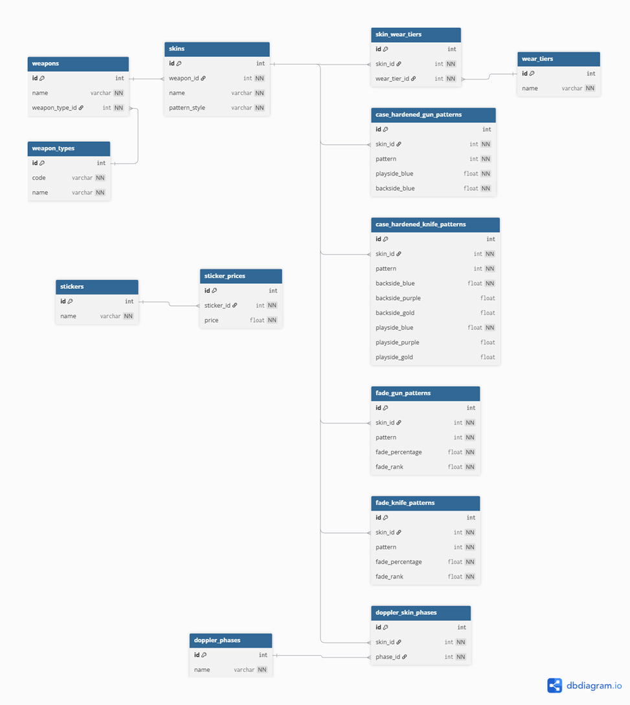

# Database Schema – Full Data Dictionary

This document provides a **column-level, formal description** of the database schema used in the CS2 Skin Price Prediction system.
Each table is described with its purpose, columns, data types, constraints, and business meaning.

---

  

## 1. weapon_types

**Purpose:**  
Stores high-level weapon categories used to classify weapons.

| Column | Type | Constraints | Description |
|------|------|-------------|-------------|
| id | int | PK, auto-increment | Internal unique identifier |
| code | varchar | NOT NULL, UNIQUE | Machine-readable weapon type code (`rifle`, `pistol`, `knife`, etc.) |
| name | varchar | NOT NULL | Human-readable weapon type name |

**Notes:**  
- `code` is used by the application and ML pipeline.
- Values are static and seeded.

---

## 2. weapons

**Purpose:**  
Stores individual weapon models (e.g. AK-47, AWP, Karambit).

| Column | Type | Constraints | Description |
|------|------|-------------|-------------|
| id | int | PK, auto-increment | Weapon identifier |
| name | varchar | NOT NULL, UNIQUE | Official weapon name |
| weapon_type_id | int | FK → weapon_types.id | Weapon category reference |

---

## 3. wear_tiers

**Purpose:**  
Defines available wear conditions for skins.

| Column | Type | Constraints | Description |
|------|------|-------------|-------------|
| id | int | PK | Wear tier identifier |
| name | varchar | NOT NULL, UNIQUE | Wear name (`Factory New`, `Minimal Wear`, etc.) |

---

## 4. skins

**Purpose:**  
Core entity describing a skin applied to a weapon.

| Column | Type | Constraints | Description |
|------|------|-------------|-------------|
| id | int | PK | Skin identifier |
| weapon_id | int | FK → weapons.id | Weapon this skin belongs to |
| name | varchar | NOT NULL | Skin name (`Case Hardened`, `Fade`, etc.) |
| pattern_style | varchar | NOT NULL | Determines valid pattern table (`ch_gun`, `fade_knife`, etc.) |

**Indexes:**  
- UNIQUE (weapon_id, name)

---

## 5. skin_wear_tiers

**Purpose:**  
Defines which wear tiers are valid for each skin.

| Column | Type | Constraints | Description |
|------|------|-------------|-------------|
| id | int | PK | Row identifier |
| skin_id | int | FK → skins.id | Skin reference |
| wear_tier_id | int | FK → wear_tiers.id | Wear tier reference |

---

## 6. case_hardened_gun_patterns

**Purpose:**  
Stores pattern-specific color distribution for Case Hardened guns.

| Column | Type | Constraints | Description |
|------|------|-------------|-------------|
| id | int | PK | Pattern row ID |
| skin_id | int | FK → skins.id | Skin reference |
| pattern | int | NOT NULL | Pattern index (1–1000) |
| playside_blue | float | NOT NULL | % of blue on play side |
| backside_blue | float | NOT NULL | % of blue on back side |

---

## 7. case_hardened_knife_patterns

**Purpose:**  
Detailed color segmentation for Case Hardened knives.

| Column | Type | Constraints | Description |
|------|------|-------------|-------------|
| id | int | PK | Pattern row ID |
| skin_id | int | FK → skins.id | Skin reference |
| pattern | int | NOT NULL | Pattern number |
| backside_blue | float | NOT NULL | Backside blue percentage |
| backside_purple | float | NULL | Backside purple percentage |
| backside_gold | float | NULL | Backside gold percentage |
| playside_blue | float | NOT NULL | Play side blue |
| playside_purple | float | NULL | Play side purple |
| playside_gold | float | NULL | Play side gold |

---

## 8. fade_gun_patterns

**Purpose:**  
Fade gradient parameters for guns.

| Column | Type | Constraints | Description |
|------|------|-------------|-------------|
| id | int | PK | Pattern ID |
| skin_id | int | FK | Skin reference |
| pattern | int | NOT NULL | Pattern index |
| fade_percentage | float | NOT NULL | Fade completion percentage |
| fade_rank | float | NOT NULL | Relative quality rank |

---

## 9. fade_knife_patterns

**Purpose:**  
Fade gradient parameters for knives.

(Same semantics as fade_gun_patterns)

---

## 10. doppler_phases

**Purpose:**  
Dictionary of Doppler phases.

| Column | Type | Constraints | Description |
|------|------|-------------|-------------|
| id | int | PK | Phase ID |
| name | varchar | UNIQUE | Phase name (`Ruby`, `Sapphire`, etc.) |

---

## 11. doppler_skin_phases

**Purpose:**  
Defines which Doppler phases are available for a skin.

| Column | Type | Constraints | Description |
|------|------|-------------|-------------|
| id | int | PK | Row ID |
| skin_id | int | FK | Doppler skin |
| phase_id | int | FK | Doppler phase |

---

## 12. stickers

**Purpose:**  
Sticker dictionary.

| Column | Type | Constraints | Description |
|------|------|-------------|-------------|
| id | int | PK | Sticker ID |
| name | varchar | UNIQUE | Sticker name |

---

## 13. sticker_prices

**Purpose:**  
Observed market prices for stickers.

| Column | Type | Constraints | Description |
|------|------|-------------|-------------|
| id | int | PK | Price row |
| sticker_id | int | FK | Sticker reference |
| price | float | CHECK > 0 | Market price |

---

## Summary

This schema:
- Is normalized to **3NF**
- Enforces referential integrity
- Models **visual-driven pricing**
- Avoids unstructured JSON
- Is suitable for ML feature extraction and analytics

## User Logic and Access Model

### Absence of Domain Users in the Schema

The database schema intentionally does **not** contain tables such as `users`, `accounts`, or `permissions`.

This is a deliberate architectural decision based on the nature of the system:

- the database stores **only technical and market-related CS2 skin data**;
- no personally identifiable information (PII) is processed or persisted;
- the system is not user-driven, but **prediction- and analytics-driven**.

As a result, application users are **not modeled as domain entities**, and no business logic depends on user-specific state stored in the database.

---

### Separation of Responsibilities

The system follows a strict separation of concerns:

| Layer | Responsibility |
|------|---------------|
| Database | Data integrity, consistency, access control |
| Application | Authentication, authorization, API exposure |
| ML services | Read-only analytical access |

User identity and authentication are handled **outside** the database, while PostgreSQL is responsible only for enforcing **who is allowed to read or modify data**.

---

### Role-Based Access Control (RBAC)

Instead of user tables, the database relies on **PostgreSQL role-based security**.

Three logical roles are defined:

- **app_read** — read-only access (SELECT)
- **app_write** — read + write access (inherits app_read)
- **app_admin** — full administrative privileges (inherits app_write)

These roles represent **permission sets**, not individual users.

---

### Database Users

Two actual PostgreSQL users are created:

- **cs2_user**
  - used by the API, ML services, and analytics
  - mapped to the `app_read` role
  - strictly read-only access

- **cs2_admin**
  - used for migrations, schema changes, and data seeding
  - mapped to the `app_admin` role
  - never used by the runtime application

The application never operates under a superuser account, which significantly reduces security risks.

---

### Schema-Level Isolation

All application tables are located in a dedicated schema (`cs2`), owned by `cs2_admin`.

This allows:
- isolation from the default `public` schema;
- fine-grained permission management;
- prevention of uncontrolled object creation.

Default privileges are configured so that newly created tables automatically receive correct access rights, eliminating manual permission errors.

---

### Application-Level Authorization

On the application side:

- Create / Update / Delete operations are exposed only through an administrative interface;
- Public API endpoints are effectively **read-only**;
- ML and analytics workloads operate exclusively under the `cs2_user` account.

This enforces a clear boundary between:
- **data consumers** (API, ML, dashboards),
- **data administrators** (schema and reference data management).

---

### Security Rationale

This approach provides several advantages:

- eliminates storage of credentials or PII in the database;
- minimizes attack surface;
- follows the principle of least privilege;
- simplifies compliance and auditing.

The absence of user tables is therefore **not a limitation**, but a conscious design choice aligned with the system’s goals and usage patterns.
