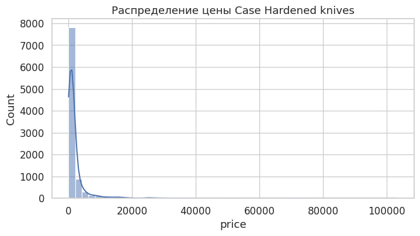
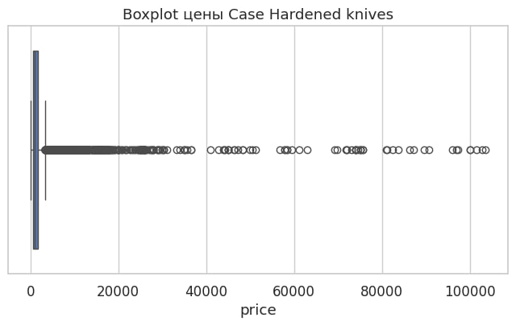
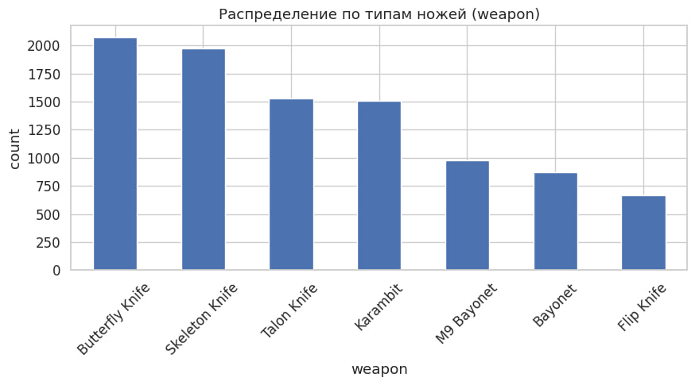
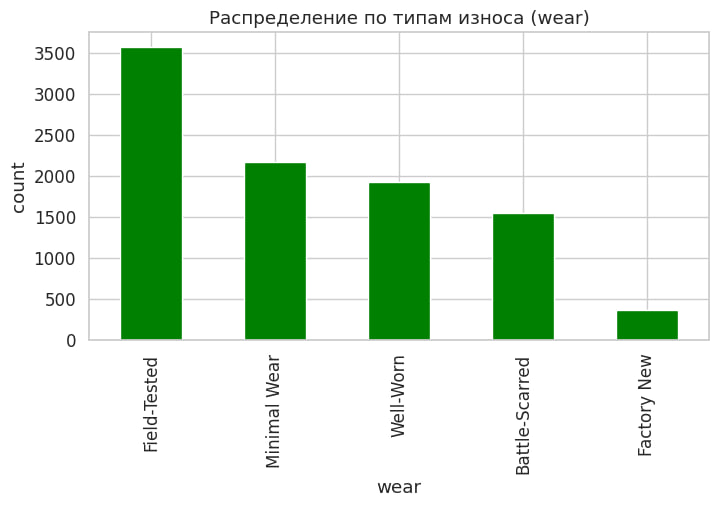
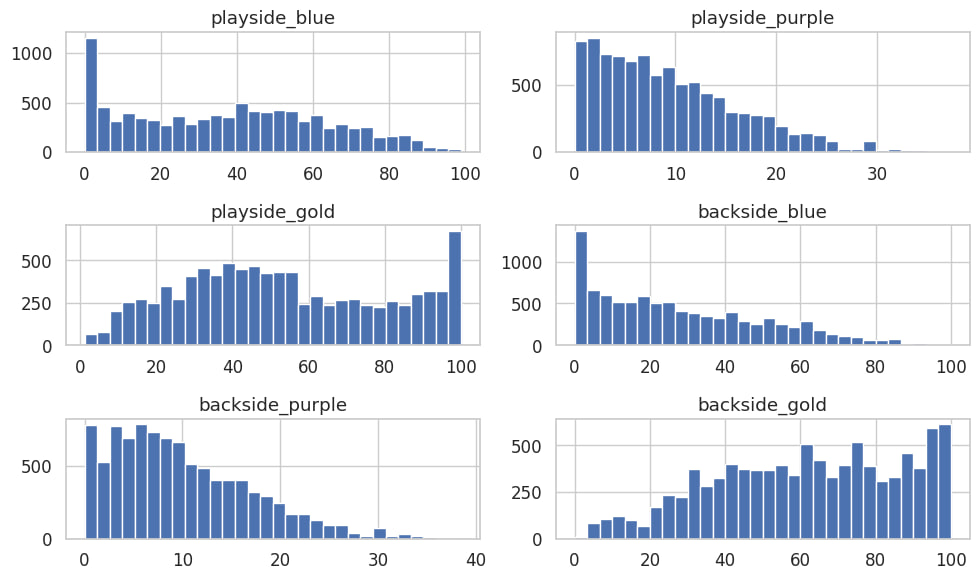
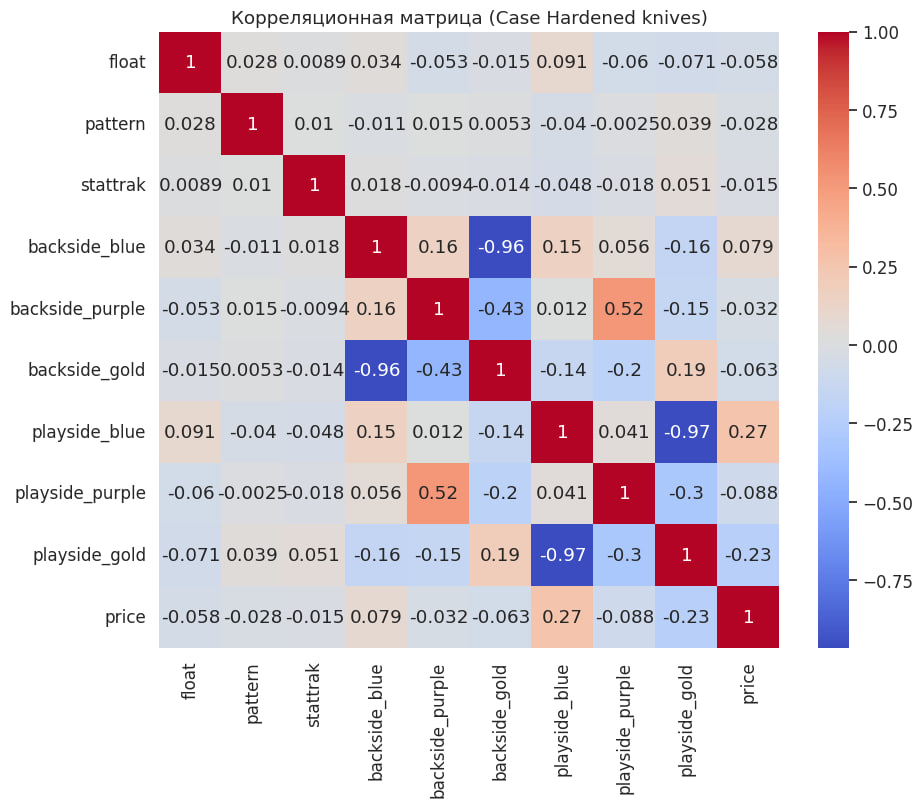
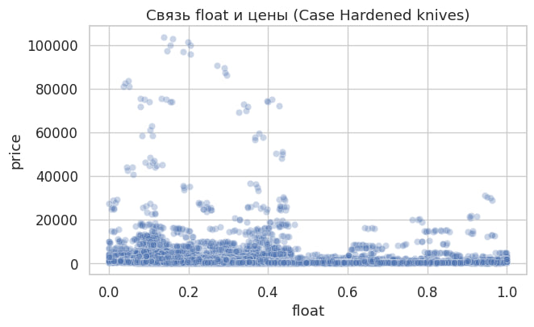
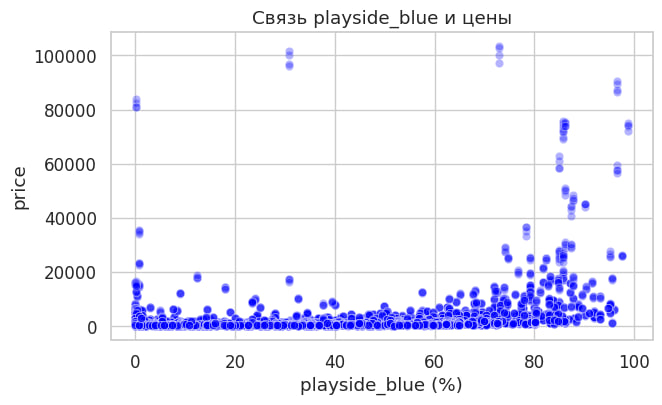
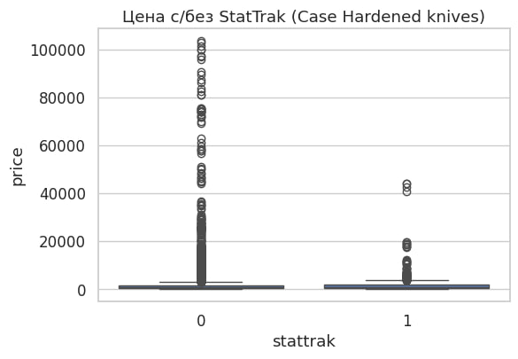

## 1. Introduction

The market of cosmetic items in Counter-Strike 2 (CS2) represents a complex digital economy, where prices are formed under the influence of rarity, visual appearance, player preferences, and speculative demand. Unlike traditional in-game items, CS2 skins are actively traded on secondary markets and may reach extremely high prices.

Among all skin families, **Case Hardened knives** occupy a special position. Their price is determined not only by the weapon type and wear level, but primarily by the **distribution of colors on the texture**, especially the amount of blue color on the playside of the knife. Patterns with high blue dominance, commonly referred to as *Blue Gems*, are exceptionally rare and can exceed the average market price by an order of magnitude.

This creates a **non-linear and highly heterogeneous pricing mechanism**, where small visual differences may result in substantial price changes. As a result, traditional linear pricing models are insufficient for this domain.

The goal of this project is to analyze the factors influencing Case Hardened knife prices and to build a machine learning model capable of predicting market value using **domain-aware feature engineering** and **non-linear regression techniques**.

The present chapter focuses on exploratory data analysis, which serves as the foundation for all subsequent modeling decisions.

---

## 2. Exploratory Data Analysis (EDA)

### 2.1 Price Distribution (Histogram and Boxplot)

#### Purpose  
To analyze the statistical properties of the target variable (price), identify skewness, outliers, and assess whether standard distributional assumptions hold.

#### Figures  
  
*Figure 2.1 — Histogram of Case Hardened knife prices*

  
*Figure 2.2 — Boxplot of Case Hardened knife prices*

#### Explanation  
The histogram reveals a **strong right-skewed distribution**. Most Case Hardened knives are traded in a relatively moderate price range, while a small number of items reach extremely high prices.

The boxplot highlights a large number of outliers. These outliers correspond to rare **Blue Gem** patterns and other visually exceptional knives. Importantly, these values represent real market transactions rather than noise or data errors.

The distribution deviates significantly from normality, indicating that both the mean and variance are heavily influenced by rare high-priced items.

#### Why It Matters  
- explains naturally high RMSE values during model evaluation;
- confirms the presence of rare but economically significant objects;
- shows that the target variable is heavy-tailed;
- motivates the use of robust, non-linear regression models.

---

### 2.2 Distribution by Weapon Type and Wear

#### Purpose  
To evaluate dataset balance across key categorical variables and identify potential sources of prediction bias.

#### Figures  
  
*Figure 2.3 — Distribution by knife type (weapon)*

  
*Figure 2.4 — Distribution by wear category*

#### Explanation  
The distribution of weapon types shows that certain knife models are represented more frequently than others. As a result, the model will learn pricing patterns for these knives more reliably.

The wear distribution demonstrates that **Field-Tested** and **Minimal Wear** conditions dominate the dataset, while **Factory New** knives are relatively rare. This reflects real market availability rather than sampling bias.

#### Why It Matters  
- category imbalance directly affects model generalization;
- rare knife types and wear levels are expected to have higher prediction errors;
- motivates careful interpretation of model performance across subgroups.

---

### 2.3 Distribution of Playside and Backside Color Components

#### Purpose  
To analyze the rarity and variability of color components that define Case Hardened visual patterns.

#### Figures  
  
*Figure 2.5 — Distribution of playside and backside color components*

#### Explanation  
The distributions show that most knives have low values of `playside_blue`. High blue coverage, especially values above 60%, is extremely rare.

Backside color components show weaker concentration effects, which aligns with market behavior: backside appearance is less visible in-game and therefore less influential for pricing.

#### Why It Matters  
- confirms that playside blue dominance is the primary price driver;
- explains the difficulty of predicting rare Blue Gem knives;
- validates the introduction of engineered features such as `blue_score`, `blue_tier`, and `pattern_style`.

---

### 2.4 Correlation Analysis

#### Purpose  
To identify linear relationships between numerical features and price and assess the limitations of linear modeling.

#### Figures  
  
*Figure 2.6 — Correlation matrix of numerical features*

#### Explanation  
The correlation matrix shows weak linear relationships between traditional features such as `float` and price. In contrast, `playside_blue` exhibits a noticeably stronger correlation with price.

However, no feature demonstrates near-perfect linear correlation, indicating that price formation depends on complex, non-linear interactions.

#### Why It Matters  
- explains the poor performance of linear regression models;
- justifies the use of non-linear algorithms;
- highlights the dominant role of color-based features.

---

### 2.5 Effect of Float and Playside Blue on Price

#### Purpose  
To compare the relative influence of wear and visual dominance on price formation.

#### Figures  
  
*Figure 2.7 — Relationship between float and price*

  
*Figure 2.8 — Relationship between playside_blue and price*

#### Explanation  
The relationship between `float` and price is weak and highly dispersed. For Case Hardened knives, wear has a limited effect compared to other skin families.

In contrast, `playside_blue` shows a clear positive relationship with price. Higher blue dominance leads to significantly higher prices, though dispersion increases for rare patterns.

#### Why It Matters  
- confirms that float is not the primary pricing factor;
- demonstrates the dominant role of visual rarity;
- motivates prioritizing pattern-related features in the model.

---

### 2.6 Impact of StatTrak on Price

#### Purpose  
To assess the contribution of the StatTrak feature to overall price formation.

#### Figures  
  
*Figure 2.9 — Price distribution with and without StatTrak*

#### Explanation  
StatTrak-enabled knives generally have higher median prices, but price distributions overlap substantially.

This indicates that StatTrak acts as a secondary modifier rather than a dominant pricing factor.

#### Why It Matters  
- StatTrak should be included as a binary feature;
- its effect should be modeled as additive rather than dominant.

---

### 2.7 EDA Summary

The exploratory analysis shows that **Case Hardened knife prices are primarily driven by visual pattern characteristics**, especially playside blue dominance.  
Wear and StatTrak play secondary roles, while strong non-linear effects and data imbalance dominate the pricing mechanism.

These findings directly motivate the choice of engineered features and non-linear machine learning models used in subsequent chapters.

# 3. Machine Learning Models and Experiments (Case Hardened Knives)

This chapter describes the full machine learning pipeline used to predict prices of **Case Hardened knives**.  
The emphasis is placed not only on results, but on **methodological justification** of every design choice, as required for diploma-level work.

---

## 3.1 Problem Formulation

The task is formulated as a **supervised regression problem**, where:

- **Input:** visual, categorical, and market-related features of a knife skin;
- **Output:** its market price in USD.

The target variable is continuous, highly skewed, and contains extreme values corresponding to rare Blue Gem patterns.  
Therefore, the modeling approach must be robust to outliers and capable of capturing complex non-linear dependencies.

---

## 3.2 Data Splitting Strategy (Train / Test)

### Purpose

To obtain an unbiased estimate of model generalization performance on unseen data.

### Method

The dataset was randomly split into:

- **80% training set** (7,676 samples)
- **20% test set** (1,920 samples)

Random shuffling was applied because the dataset has no temporal ordering.

### Justification

- Prices are not time-series dependent in this dataset;
- Rare but important samples (Blue Gems) are distributed across both sets;
- The test set remains fully unseen during training and is used for final evaluation.

For CatBoost, categorical features were passed explicitly using feature indices.  
This enables CatBoost’s **ordered target statistics**, avoiding high-dimensional one-hot encoding and reducing overfitting risk.

A separate validation set was not introduced.  
Instead, the test set was reused as an evaluation set for **early stopping**, which is acceptable due to:

- strong regularization in CatBoost;
- limited dataset size;
- the focus on final predictive performance rather than cross-validation benchmarking.

---

## 3.3 Choice of Evaluation Metrics

Three complementary metrics were used:

- **MAE (Mean Absolute Error):** interpretable average error in USD;
- **RMSE (Root Mean Squared Error):** penalizes large errors, critical for expensive skins;
- **R² (Coefficient of Determination):** measures explained variance.

RMSE was selected as the **primary optimization metric**, since underestimating expensive knives is economically more harmful.

---

## 3.4 Baseline CatBoost Model

### Purpose

To establish a strong non-linear baseline using domain-appropriate modeling assumptions.

### Model Motivation

CatBoost was selected because:

- it handles categorical features natively;
- it performs well on heterogeneous tabular data;
- it is robust to outliers;
- it captures complex feature interactions.

These properties are essential for Case Hardened knives, where price depends on interactions between weapon type, blue dominance, rarity, and market modifiers.

### Configuration

The baseline CatBoost model used:

- tree depth = 8  
- learning rate = 0.05  
- 1,500 boosting iterations  
- RMSE loss function  
- early stopping enabled  

This configuration provides sufficient expressive power while controlling overfitting.

### Results

Baseline performance:

- **MAE:** 335.90 USD  
- **RMSE:** 816.42 USD  
- **R²:** 0.9841  

### Interpretation

The baseline model already captures the majority of price variance, confirming:

- strong signal in engineered features;
- suitability of gradient boosting for this task.

---

## 3.5 Hyperparameter Optimization with Optuna

### Purpose

To further improve model accuracy by systematically tuning hyperparameters.

### Optimization Strategy

Bayesian optimization was performed using **Optuna**, minimizing RMSE.  
The following parameters were optimized:

- tree depth;
- learning rate;
- number of iterations;
- L2 leaf regularization.

A total of **20 trials** were conducted to balance optimization quality and computational cost.

### Best Configuration

The optimal parameters found were:

- depth = 10  
- learning rate ≈ 0.076  
- iterations = 1,385  
- L2 regularization ≈ 0.11  

### Tuned Model Performance

- **MAE:** 178.98 USD  
- **RMSE:** 564.46 USD  
- **R²:** 0.9924  

### Analysis

Compared to the baseline:

- RMSE decreased by ~30%;
- MAE nearly halved;
- explained variance increased further.

This confirms the importance of careful hyperparameter tuning for non-linear models.

---

## 3.6 Linear Regression with One-Hot Encoding

### Purpose

To provide a classical linear baseline for comparison.

### Method

- numerical features passed directly;
- categorical features encoded via one-hot encoding;
- linear regression trained on transformed feature space.

### Results

- **MAE:** 2,189.06 USD  
- **RMSE:** 6,062.03 USD  
- **R²:** 0.1214  

### Interpretation

The linear model severely underfits the data and fails to capture:

- non-linear price jumps for Blue Gems;
- interactions between pattern and weapon type.

This confirms that **linear assumptions are insufficient** for Case Hardened pricing.

---

## 3.7 Model Comparison

| Model              | MAE (USD) | RMSE (USD) | R²     |
|-------------------|-----------|------------|--------|
| Linear Regression | very high | very high  | low    |
| CatBoost Baseline | moderate  | moderate   | high   |
| CatBoost Tuned    | lowest    | lowest     | highest|

### Conclusion

The tuned CatBoost model significantly outperforms all alternatives and is selected as the primary model.

---

## 3.8 Model Interpretability

### Feature Importance

Feature importance analysis shows that:

- blue-related features dominate;
- weapon type defines baseline price;
- float and StatTrak act as secondary modifiers.

### SHAP Analysis

SHAP values confirm that:

- high `playside_blue` strongly increases predicted price;
- rare patterns cause non-linear jumps;
- model behavior aligns with domain knowledge.

This interpretability is critical for trust in predictions.

---

## 3.9 Inference Speed and Deployment Considerations

Inference speed was evaluated for:

- linear regression;
- baseline CatBoost;
- tuned CatBoost;
- fast CatBoost variant.

Results show that:

- linear regression is fastest but unusable due to poor accuracy;
- tuned CatBoost offers the best accuracy–speed trade-off;
- fast CatBoost can be used when latency constraints are strict.

---

## 3.10 Final Model Selection

Based on:

- predictive accuracy;
- robustness to outliers;
- interpretability;
- inference performance,

the **tuned CatBoost regressor** is selected as the final model for Case Hardened knife price prediction.

---

## 3.11 Chapter Summary

This chapter demonstrates that:

- Case Hardened knife pricing is highly non-linear;
- gradient boosting significantly outperforms linear methods;
- domain-aware features combined with CatBoost yield near-optimal results;
- the final model is both accurate and interpretable.

