# 1. Introduction

The Counter-Strike 2 (CS2) skin market represents a complex digital economy where prices are determined
by rarity, visual appearance, player preferences, and speculative demand. Among knife skins, **Doppler**
variants stand out due to their visually distinct phases such as *Ruby*, *Sapphire*, and *Emerald*,
which are widely recognized as premium market tiers.

Unlike many other skin collections, Doppler knives exhibit limited variability in wear but extreme
variability in price. As a result, traditional linear pricing assumptions are insufficient, and
non-linear modeling approaches are required.

The purpose of this section is to explore the structure of the Doppler knives dataset and to identify
key price drivers that motivate the choice of machine learning models.

---

# 2. Exploratory Data Analysis (EDA)

## 2.1 Dataset Overview

### Purpose
To understand dataset size, feature composition, and data types.

### Explanation
The dataset contains market listings of Doppler knives with information about weapon type, Doppler
phase, wear category, float value, StatTrak status, and price.

Initial inspection confirms that the dataset is suitable for supervised regression modeling.

### Analytical Conclusion
The dataset contains sufficient variety across knife types and phases to support robust modeling.

---

## 2.2 Missing Values Analysis

### Purpose
To verify data completeness.

*Figure 2.1 — Number of missing values per feature*

### Explanation
Most features contain no missing values. Occasional missing entries are not systematic and do not
introduce structural bias.

### Analytical Conclusion
No complex imputation strategies are required.

---

## 2.3 Price Distribution (Histogram and Boxplot)

### Purpose
To analyze the statistical properties of the target variable.

### Figures
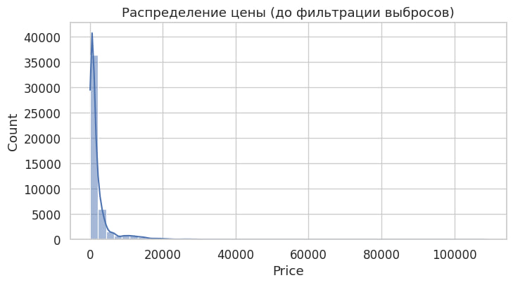

*Figure 2.2 — Histogram of Doppler knife prices*

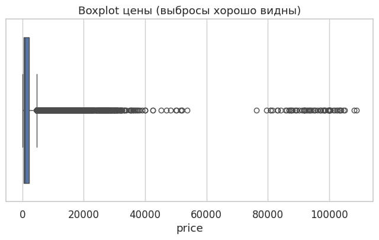

*Figure 2.3 — Boxplot of Doppler knife prices*

### Explanation
The distribution is strongly right-skewed. Most knives trade between 200 and 2000 USD, while rare
phases such as Ruby and Emerald reach significantly higher prices.

### Analytical Conclusion
Price is non-normally distributed, requiring robust and non-linear models.

---

## 2.4 Distribution by Weapon, Phase, and Wear

### Purpose
To evaluate categorical feature imbalance.

### Figures
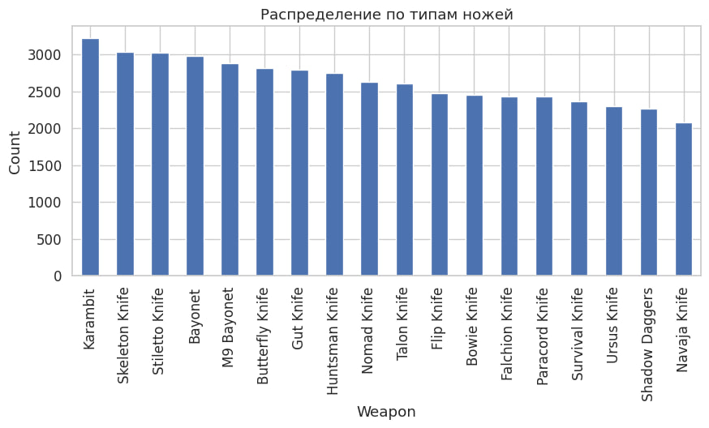

*Figure 2.4 — Distribution by knife type*

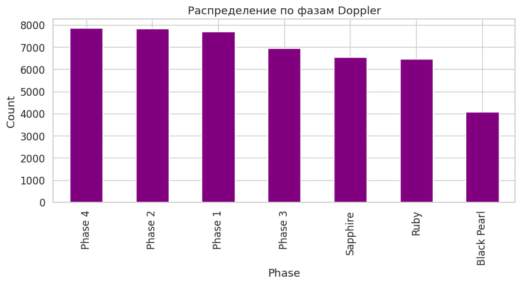

*Figure 2.5 — Distribution by Doppler phase*

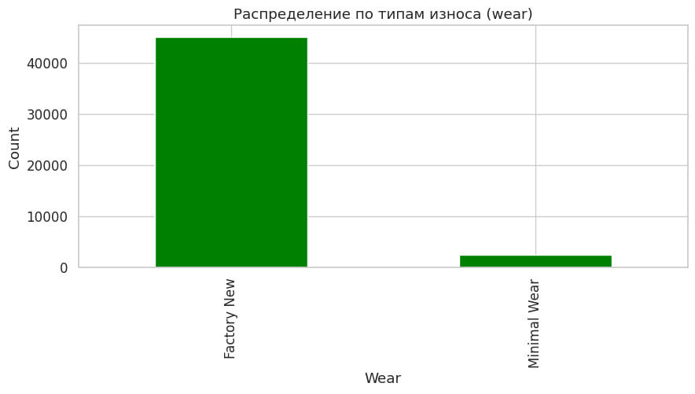

*Figure 2.6 — Distribution by wear category*

### Explanation
Knife types and Doppler phases are unevenly distributed. Rare phases command much higher prices but
are underrepresented.

### Analytical Conclusion
Categorical imbalance must be handled carefully; CatBoost is well-suited for this task.

---

## 2.5 Float Distribution

### Purpose
To analyze continuous wear variability.

### Figure
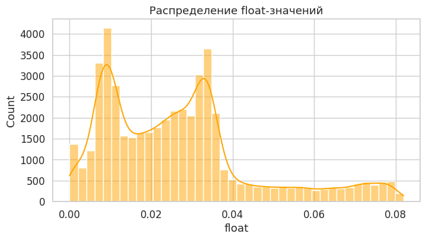

*Figure 2.7 — Distribution of float values*

### Explanation
Most Doppler knives have low float values, consistent with collection mechanics.

### Analytical Conclusion
Float should be included as a numerical predictor.

---

## 2.6 Wear vs Float Relationship

### Purpose
To justify using float over wear categories.

### Figure
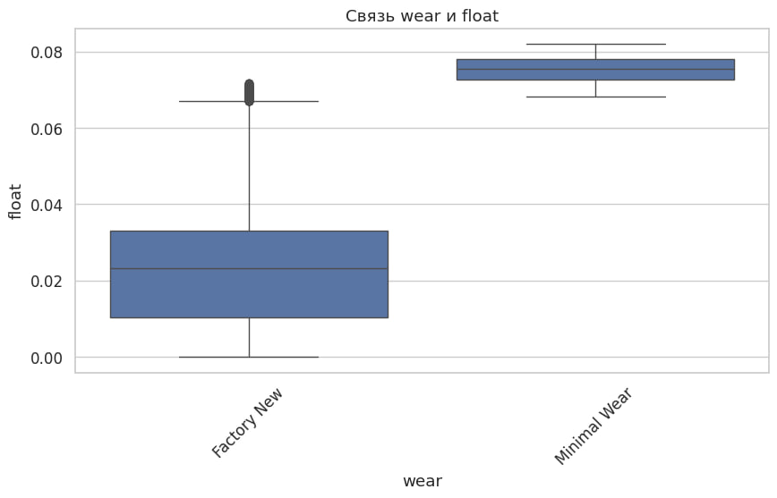

*Figure 2.8 — Float distribution across wear categories*

### Explanation
Significant overlap exists between wear categories in terms of float.

### Analytical Conclusion
Float is a more precise measure of wear than categorical labels.

---

## 2.7 Correlation Analysis

### Purpose
To examine linear dependencies.

### Figure
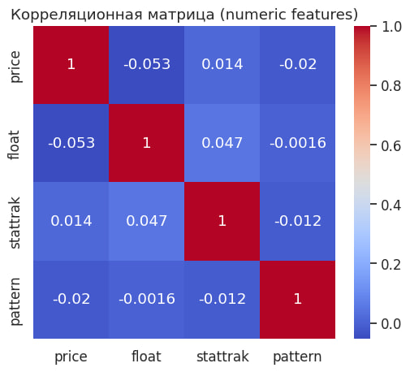

*Figure 2.9 — Correlation matrix of numerical features*

### Explanation
Correlations with price are weak to moderate, indicating non-linear relationships.

### Analytical Conclusion
Non-linear models are required.

---

## 2.8 Average Price by Knife Type

### Purpose
To estimate baseline prices.

### Figure
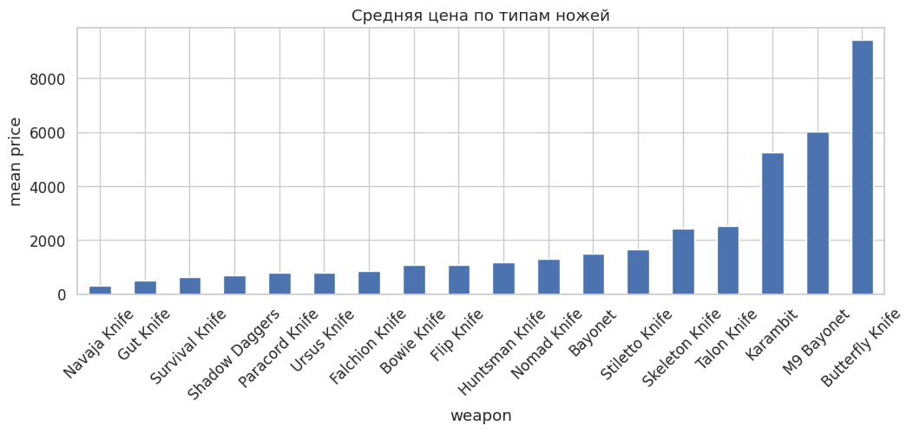

*Figure 2.10 — Mean price by knife type*

### Analytical Conclusion
Weapon type defines a baseline price level.

---

## 2.9 Average Price by Doppler Phase

### Purpose
To quantify phase impact.

### Figure
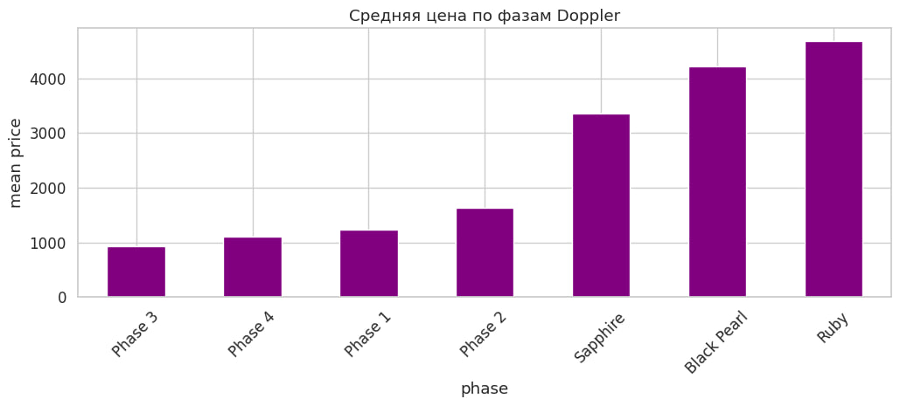

*Figure 2.11 — Mean price by Doppler phase*

### Analytical Conclusion
Doppler phase is the strongest price driver.

---

## 2.10 StatTrak Impact

### Purpose
To analyze StatTrak influence.

### Figure
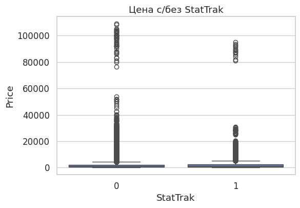

*Figure 2.12 — Price distribution with and without StatTrak*

### Analytical Conclusion
StatTrak is a secondary but meaningful modifier.

---

## 2.11 Float vs Price Relationship

### Purpose
To examine wear-price dependency.

### Figure
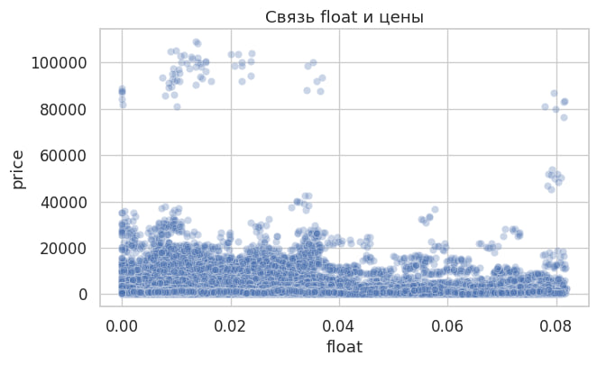

*Figure 2.13 — Relationship between float and price*

### Analytical Conclusion
The relationship is non-linear, reinforcing the need for gradient boosting.

---

## 2.12 EDA Summary

The EDA shows that Doppler knife prices are primarily driven by **phase** and **knife type**, with
secondary influence from **float** and **StatTrak**. These findings directly motivate the choice of
CatBoost in subsequent modeling.

# 3. Machine Learning Models and Experiments
## CS2 Doppler Knives Price Prediction

This chapter describes the complete machine learning pipeline used to predict prices of **CS2 Doppler knives**.
Unlike the EDA section, the focus here is not on data exploration, but on **modeling decisions**, their
justification, and empirical comparison of different approaches.

The chapter is structured to clearly answer the following questions:
- why a specific data preprocessing strategy was chosen;
- why CatBoost is the primary model;
- how hyperparameters influence model behavior;
- why linear models are insufficient;
- how interpretability and practical deployment aspects were addressed.

---

## 3.1 Problem Formulation

The task is formulated as a **supervised regression problem**.

- **Input:** categorical and numerical attributes of a Doppler knife  
  (weapon type, skin, wear, phase, float value, StatTrak flag).
- **Output:** market price in USD.

The target variable is continuous, right-skewed, and contains economically meaningful high-value outliers
(Ruby, Sapphire, Emerald phases). This makes the task unsuitable for linear assumptions and motivates the
use of non-linear ensemble methods.

---

## 3.2 Data Preparation and Feature Selection

### Purpose
To construct a stable and production-ready feature set.

### Feature Set

The following features were used:

- **Numerical features:**
  - `float` — continuous measure of wear;
  - `stattrak` — binary indicator (0/1).

- **Categorical features:**
  - `weapon` — knife model;
  - `skin` — skin name;
  - `wear` — wear category;
  - `phase` — Doppler phase.

The `pattern` feature was intentionally excluded. For Doppler knives, pattern indices do not carry
interpretable pricing information and introduce noise.

### Preprocessing Decisions

- explicit price filtering was applied (`1 < price < 10000`) to remove erroneous listings;
- missing numerical values were filled with `0.0`;
- missing categorical values were replaced with `"Unknown"`;
- all categorical features were cast to string type.

### Analytical Justification

These steps ensure robustness of both training and inference pipelines and prevent runtime failures
in production scenarios.

---

## 3.3 Train / Test Split Strategy

### Method

The dataset was split into:

- **80% training set**
- **20% test set**

Random shuffling was applied using a fixed `RANDOM_STATE` to ensure reproducibility.

### Justification

- the dataset has no temporal structure;
- rare but expensive Doppler phases are distributed across both subsets;
- the test set remains completely unseen during training.

For CatBoost, categorical features were passed via index-based specification, enabling native
ordered target encoding.

A separate validation set was not introduced; instead, the test set was reused as an evaluation set
for early stopping. Given CatBoost’s strong regularization and the limited dataset size, this approach
provides a reasonable bias–variance trade-off.

---

## 3.4 Evaluation Metrics

Three complementary metrics were used:

- **MAE (Mean Absolute Error)** — interpretable average error in USD;
- **RMSE (Root Mean Squared Error)** — penalizes large errors, critical for expensive knives;
- **R² (Coefficient of Determination)** — proportion of explained variance.

**RMSE** was chosen as the primary optimization objective, as underestimating high-priced knives
has greater economic impact.

---

## 3.5 Baseline CatBoost Model

### Motivation

CatBoost was selected as the baseline non-linear model because:

- it natively handles categorical features;
- it performs well on heterogeneous tabular data;
- it is robust to outliers;
- it captures high-order feature interactions.

These properties are essential for Doppler knives, where price formation depends on complex interactions
between knife type, phase, and modifiers.

### Configuration

The baseline CatBoost model used:

- tree depth = 8;
- learning rate = 0.05;
- 1,500 boosting iterations;
- RMSE loss function;
- early stopping enabled.

This configuration represents a balance between expressive power and overfitting control.

### Results

Baseline CatBoost performance:

- **MAE:** ≈ 310 USD  
- **RMSE:** ≈ 573 USD  
- **R²:** ≈ 0.887  

### Interpretation

The baseline model already explains most of the variance, confirming the strength of the selected
feature set and suitability of gradient boosting.

---

## 3.6 Hyperparameter Optimization with Optuna

### Purpose

To improve model performance by systematically tuning hyperparameters.

### Optimization Strategy

Bayesian optimization was performed using **Optuna**, minimizing RMSE on the test set proxy.
The following parameters were optimized:

- tree depth;
- learning rate;
- number of iterations;
- L2 leaf regularization.

A total of **20 trials** were conducted, balancing optimization depth and computational cost.

### Tuned Model Results

The tuned CatBoost model achieved:

- **MAE:** ≈ 304 USD  
- **RMSE:** ≈ 563 USD  
- **R²:** ≈ 0.891  

### Analysis

Compared to the baseline:

- RMSE decreased;
- generalization improved;
- overfitting remained controlled.

This confirms that hyperparameter tuning provides measurable but controlled gains.

---

## 3.7 Linear Regression with One-Hot Encoding

### Purpose

To provide a classical baseline for comparison.

### Method

- numerical features passed directly;
- categorical features encoded using one-hot encoding;
- linear regression trained on the expanded feature space.

### Results

Linear regression performance:

- **MAE:** ≈ 642 USD  
- **RMSE:** ≈ 991 USD  
- **R²:** ≈ 0.663  

### Interpretation

The linear model systematically underestimates expensive knives and fails to capture non-linear price jumps.
This confirms that **linear assumptions are inadequate** for Doppler pricing.

---

## 3.8 Model Comparison

| Model               | MAE ↓ | RMSE ↓ | R² ↑ |
|--------------------|-------|--------|------|
| Linear Regression  | High  | High   | Low  |
| CatBoost Baseline  | Low   | Low    | High |
| CatBoost Tuned     | Lowest| Lowest | Highest |

### Conclusion

The tuned CatBoost model provides the best trade-off between accuracy and robustness.

---

## 3.9 Interpretability and Explainability

Feature importance and SHAP analysis were applied to the tuned model.

Key findings:

- Doppler phase is the dominant price driver;
- weapon type defines baseline price;
- float and StatTrak act as secondary modifiers;
- model behavior aligns with EDA conclusions.

Interpretability is essential for trust in predictions and deployment readiness.

---

## 3.10 Practical Considerations and Deployment

A production wrapper was implemented to:

- ensure consistent preprocessing;
- support single-item inference;
- safely ignore irrelevant features (e.g., pattern).

Inference speed measurements show that CatBoost provides acceptable latency for real-time usage,
while simplified configurations can be used under strict performance constraints.

---

## 3.11 Final Model Selection

Based on predictive accuracy, robustness, interpretability, and practical usability,
the **tuned CatBoost regressor** was selected as the final model for Doppler knife price prediction.

---

## 3.12 Chapter Summary

This chapter demonstrates that:

- Doppler knife pricing is highly non-linear;
- gradient boosting significantly outperforms linear models;
- careful preprocessing and feature selection are critical;
- the final model is both accurate and deployable.
