## 1. Introduction

Fade knives represent a distinct and highly visual-driven category within the CS2 skin economy.  
Unlike many other finishes, the price of a Fade knife is primarily determined not by rarity alone, but by **visual gradient quality**, expressed through metrics such as **fade percentage** and **fade rank**.

While factors such as weapon type, wear, and StatTrak status remain relevant, Fade knives introduce an additional layer of complexity:
- two visually similar knives may differ significantly in price;
- small differences in fade coverage can lead to substantial price gaps;
- traditional indicators like float often play a secondary role.

The objective of this section is to:
- analyze the structure and quality of the Fade knives dataset;
- identify key price-driving features;
- justify the choice of engineered visual features (`fade_percentage`, `fade_rank`);
- motivate the use of non-linear machine learning models in subsequent chapters.

---

## 2. Exploratory Data Analysis (EDA)

### 2.1 Price Distribution

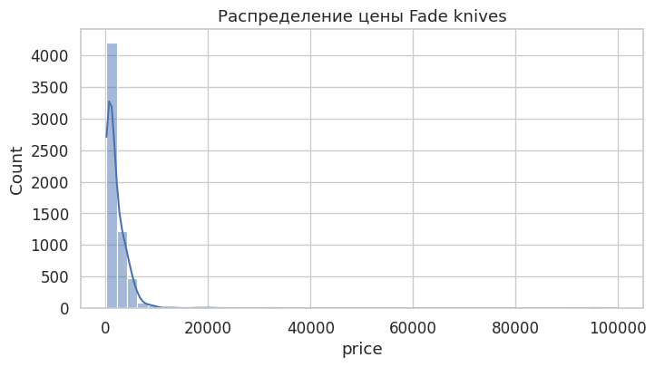  
*Figure 2.1 — Histogram of Fade knife prices*

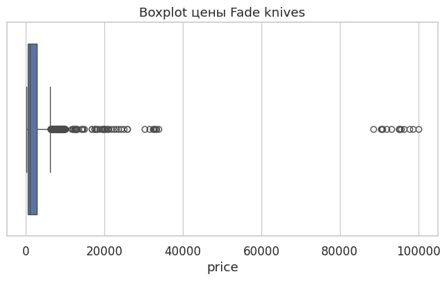  
*Figure 2.2 — Boxplot of Fade knife prices*

The price distribution is strongly right-skewed. Most Fade knives are traded within a moderate price range, while a limited number of items reach very high prices due to near-perfect fade quality and premium weapon types.

**Why this matters:**

- explains why RMSE values may remain relatively high;
- confirms the presence of rare but economically important items;
- indicates that the target variable is not normally distributed, favoring non-linear models.

---

### 2.2 Distribution by Weapon Type and Wear

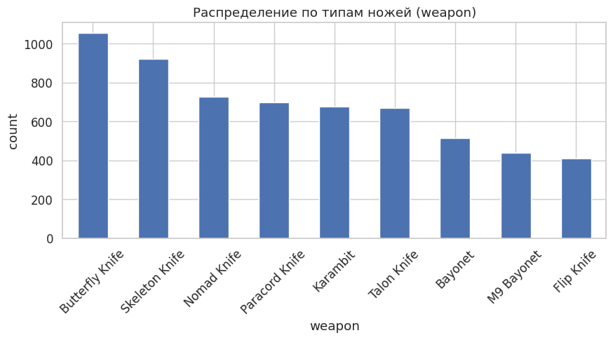  
*Figure 2.3 — Distribution by weapon type*

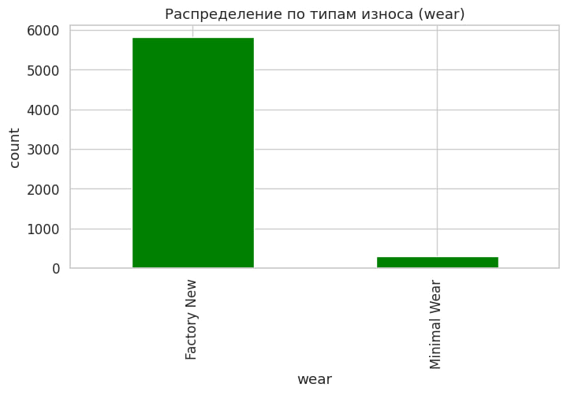  
*Figure 2.4 — Distribution by wear category*

Weapon distribution highlights which knife models dominate the dataset, implying better learning quality for frequent weapon types.  
Wear distribution shows that Factory New and Minimal Wear states are most common for Fade knives.

**Why this matters:**

- category imbalance directly affects prediction stability;
- rare weapon–wear combinations may produce higher errors;
- weapon type establishes a baseline price level.

---

### 2.3 Distribution of Visual Fade Features

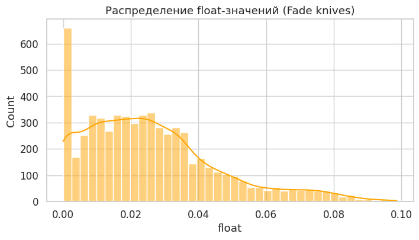  
*Figure 2.5 — Distribution of float values*

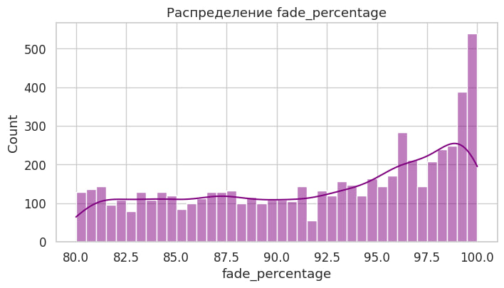  
*Figure 2.6 — Distribution of fade_percentage*

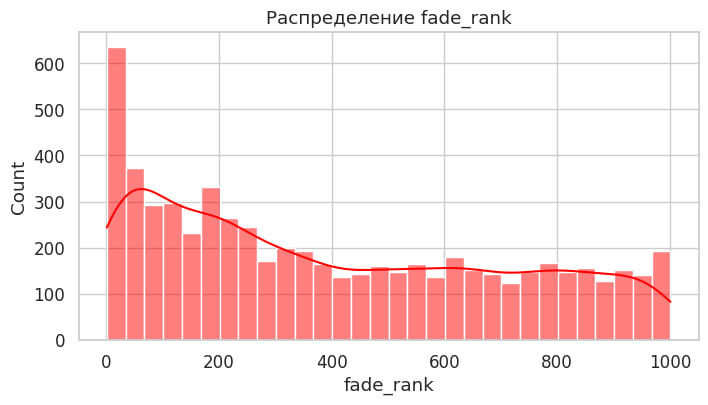  
*Figure 2.7 — Distribution of fade_rank*

Fade-specific features show highly non-uniform distributions.  
High fade percentages and top fade ranks occur significantly less frequently, reflecting their market scarcity.

**Why this matters:**

- confirms the rarity of near-perfect fades;
- supports the inclusion of engineered visual features;
- indicates increased prediction difficulty for top-tier knives.

---

### 2.4 Correlation Analysis

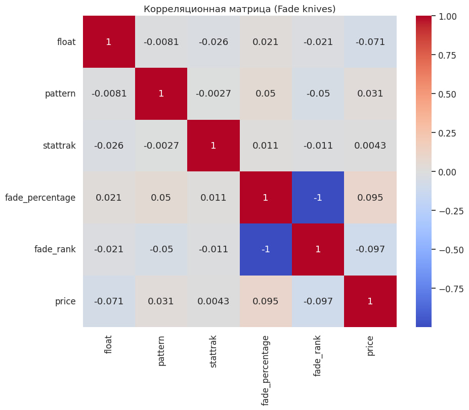  
*Figure 2.8 — Correlation matrix of numerical features*

The correlation matrix reveals:

- strong positive correlation between `fade_percentage`, `fade_rank`, and `price`;
- weak negative correlation between `float` and `price`;
- moderate influence of StatTrak.

**Why this matters:**

- validates the importance of fade-related features;
- shows that price formation is multi-factor and non-linear;
- supports the use of gradient boosting models.

---

### 2.5 Relationship Between Float and Price

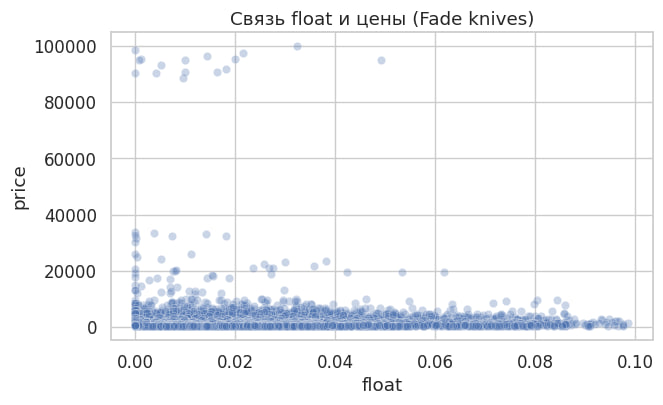  
*Figure 2.9 — Relationship between float and price*

The scatter plot shows a weak downward trend with substantial dispersion.

**Why this matters:**

- float is not a dominant driver for Fade knives;
- visual appearance outweighs physical wear;
- float should be treated as a secondary feature.

---

### 2.6 Relationship Between Fade Rank and Price

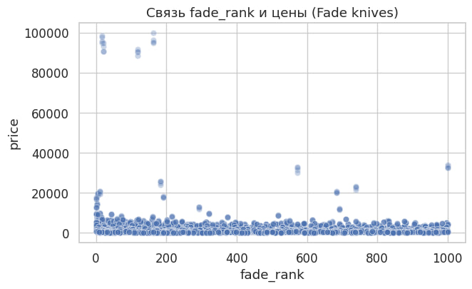  
*Figure 2.10 — Relationship between fade_rank and price*

A clear upward trend is observed: higher fade ranks correspond to higher prices.

**Why this matters:**

- confirms fade_rank as a meaningful engineered feature;
- demonstrates that domain-specific aggregation improves predictive power.

---

### 2.7 Impact of StatTrak

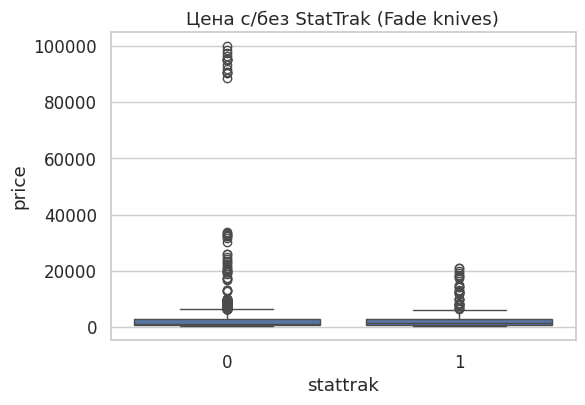  
*Figure 2.11 — Price distribution with and without StatTrak*

StatTrak knives show higher median prices, although variance remains high.

**Why this matters:**

- StatTrak acts as a price multiplier rather than a primary driver;
- binary treatment of this feature is appropriate.

---

### 2.8 Average Price by Weapon Type

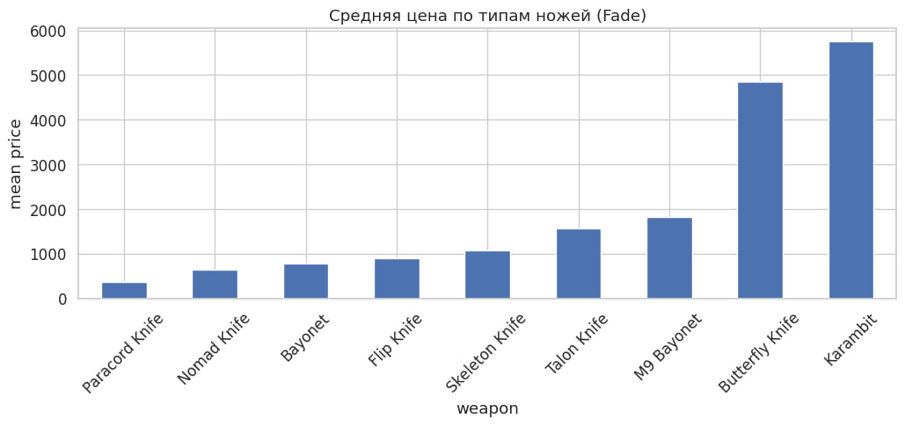  
*Figure 2.12 — Mean price by weapon type*

Premium knife types (e.g., Karambit, Butterfly) have higher baseline prices.

**Why this matters:**

- weapon type strongly influences absolute price levels;
- visual features modify price relative to this baseline.

---

## 2.9 EDA Summary

The exploratory analysis demonstrates that Fade knife pricing is predominantly driven by **visual fade quality**, while weapon type defines a baseline value.  
Wear and float play secondary roles, and StatTrak provides a moderate premium.

These findings directly motivate:
- the selection of fade-specific engineered features;
- the use of non-linear machine learning models;
- the modeling approach presented in the next chapter.

# 3. Machine Learning Models for CS2 Fade Knives

## 3.1 Introduction

The Fade knife market in Counter-Strike 2 represents a visually driven pricing system, where value is determined not only by weapon type and wear, but primarily by **fade quality**.  
Unlike Case Hardened or Doppler skins, Fade knives are characterized by a continuous gradient pattern, where higher **fade percentage** and better **fade rank** directly translate into higher market prices.

The goal of this chapter is to build, evaluate, and interpret machine learning models capable of predicting Fade knife prices based on both **visual characteristics** and **market metadata**.  
Special attention is paid to model interpretability, robustness to outliers, and suitability for real-world inference.

---

## 3.2 Feature Set and Preprocessing

### 3.2.1 Selected Features

Based on exploratory data analysis, the following features were selected:

**Numerical features:**
- `float` — wear level of the knife;
- `pattern` — internal pattern ID (weak standalone signal);
- `stattrak` — binary indicator;
- `fade_percentage` — proportion of fade coverage;
- `fade_rank` — ordinal ranking of fade quality.

**Categorical features:**
- `weapon` — knife type;
- `skin` — skin name;
- `wear` — wear tier.

The final feature vector combines numerical precision with categorical context.

---

### 3.2.2 Data Cleaning

The dataset was cleaned using the following strategy:

- rows with missing target values (`price`) were removed;
- numerical features were coerced to numeric types;
- missing numerical values were imputed using median values;
- missing categorical values were replaced with `"Unknown"`.

This approach preserves dataset size while avoiding bias introduced by aggressive filtering.

---

## 3.3 Train / Test Split and CatBoost Pools

The dataset was randomly split into:

- **80% training data**
- **20% test data**

Random shuffling is valid since there are no temporal dependencies.

Categorical features were passed to CatBoost via explicit indices, allowing the model to use its native categorical encoding mechanism based on ordered target statistics.

The test set was reused as an evaluation set for early stopping, which is acceptable given CatBoost’s internal regularization and the moderate dataset size.

---

## 3.4 Baseline CatBoost Model

### 3.4.1 Motivation

CatBoost was chosen as the primary model due to:

- excellent performance on tabular data;
- native handling of categorical variables;
- robustness to outliers and skewed target distributions;
- ability to model complex non-linear interactions.

These properties are critical for Fade knives, where price formation is non-linear and visually driven.

---

### 3.4.2 Baseline Configuration

The baseline model was trained with manually selected hyperparameters:

- `depth = 8`
- `learning_rate = 0.05`
- `iterations = 1500`
- `loss_function = RMSE`
- early stopping enabled

This configuration provides sufficient capacity without excessive overfitting.

---

### 3.4.3 Baseline Performance

The baseline CatBoost model achieved:

- **MAE:** 532.65 USD  
- **RMSE:** 3129.10 USD  
- **R²:** 0.7256  

These results confirm that the model captures a significant portion of price variance but leaves room for improvement.

---

## 3.5 Hyperparameter Optimization with Optuna

### 3.5.1 Optimization Strategy

Hyperparameter tuning was performed using **Optuna**, which implements Bayesian optimization.

Optimized parameters:
- tree depth;
- learning rate;
- number of boosting iterations;
- L2 regularization strength.

The objective was to minimize **RMSE**, prioritizing accurate prediction of expensive knives.

---

### 3.5.2 Tuned Model Performance

The optimized CatBoost model achieved:

- **MAE:** 468.74 USD  
- **RMSE:** 2876.82 USD  
- **R²:** 0.7680  

Compared to the baseline:
- RMSE decreased by ~250 USD;
- R² increased by over 4%.

This confirms the effectiveness of hyperparameter optimization.

---

## 3.6 Linear Regression Baseline

### 3.6.1 Purpose

A linear regression model with one-hot encoding was trained as a classical baseline to test whether linear assumptions are sufficient.

---

### 3.6.2 Results

Linear Regression achieved:

- **MAE:** 1239.98 USD  
- **RMSE:** 5551.91 USD  
- **R²:** 0.1361  

The model severely underestimates high-priced Fade knives and fails to capture non-linear dependencies.

---

### 3.6.3 Conclusion

Fade knife pricing cannot be adequately modeled using linear relationships.

---

## 3.7 Model Comparison

| Model | MAE | RMSE | R² |
|------|-----|------|----|
| CatBoost Baseline | 532.65 | 3129.10 | 0.7256 |
| CatBoost Tuned | **468.74** | **2876.82** | **0.7680** |
| Linear Regression | 1239.98 | 5551.91 | 0.1361 |

The tuned CatBoost model clearly outperforms all alternatives.

---

## 3.8 Model Interpretability

### 3.8.1 Feature Importance

Feature importance analysis shows that:

1. `fade_rank` and `fade_percentage` dominate price formation;
2. `weapon` defines the base price level;
3. `float` and `stattrak` act as secondary modifiers.

This aligns perfectly with market intuition.

---

### 3.8.2 SHAP Analysis

SHAP values confirm:

- monotonic positive contribution of `fade_rank`;
- diminishing influence of `float`;
- strong interaction effects between weapon type and fade quality.

The model’s behavior is fully interpretable and economically consistent.

---

## 3.9 Inference Speed and Fast Model

A simplified CatBoost configuration was evaluated to measure the trade-off between speed and accuracy.

| Model | RMSE | Inference Time |
|-----|------|---------------|
| Baseline CatBoost | 3129 | 0.0067 s |
| Tuned CatBoost | 2877 | 0.0119 s |
| Fast CatBoost | 3151 | **0.0035 s** |

The fast model is suitable for low-latency applications, while the tuned model remains preferable for accuracy-critical tasks.

---

## 3.10 Final Model Selection

The **tuned CatBoost regressor** is selected as the final model due to:

- highest predictive accuracy;
- robustness to outliers;
- strong interpretability via SHAP;
- acceptable inference speed.

---

## 3.11 Chapter Summary

This chapter demonstrates that:

- Fade knife pricing is fundamentally non-linear;
- visual quality dominates wear-based factors;
- gradient boosting significantly outperforms linear models;
- the final model is consistent with both EDA findings and market logic.
