# 1. Exploratory Data Analysis for CS2 Fade Rifles

## 1.1 Introduction

Fade rifles in Counter-Strike 2 represent a category of skins where **visual quality of the gradient**
plays a decisive role in price formation.  
Unlike simple wear-based skins, Fade pricing is driven by a combination of:

- weapon type;
- gradient quality (`fade_rank`, `fade_percentage`);
- wear (`float`);
- additional modifiers such as StatTrak and stickers.

The purpose of this exploratory data analysis (EDA) is to:

- understand the structure of the Fade rifles dataset;
- identify key price-driving factors;
- justify feature selection for machine learning models;
- motivate the use of non-linear models such as CatBoost.

---

## 2.1 Dataset Overview

The dataset contains market listings of CS2 Fade rifles with the following structure:

- **Target variable**
  - `price` — market price of the rifle in USD.

- **Numerical features**
  - `float`, `pattern`, `stattrak`;
  - fade-specific features: `fade_percentage`, `fade_rank`;
  - sticker-related aggregates: `stickers_*`, `slot*_price`.

- **Categorical features**
  - `weapon` — rifle type;
  - `skin` — skin name;
  - `wear` — wear category.

Missing values are present in several sticker-related columns and are handled during preprocessing.

---

## 2.2 Price Distribution

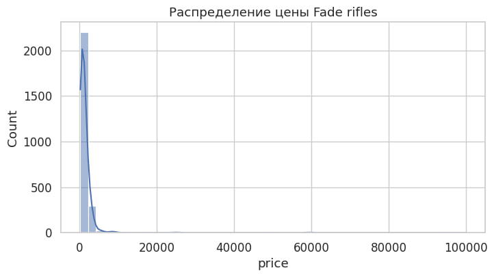

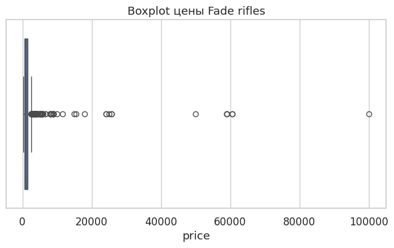

### Price Distribution (Histogram + Boxplot)

**Observations**

- The price distribution is **right-skewed**.
- Most Fade rifles are concentrated in the low-to-mid price range.
- A small number of expensive items form a long right tail.

**Why this matters**

- RMSE will be significantly influenced by rare expensive skins.
- The presence of outliers requires robust models.
- The target variable is not normally distributed, making linear assumptions unsuitable.

---

## 2.2 Distribution by Weapon Type and Wear

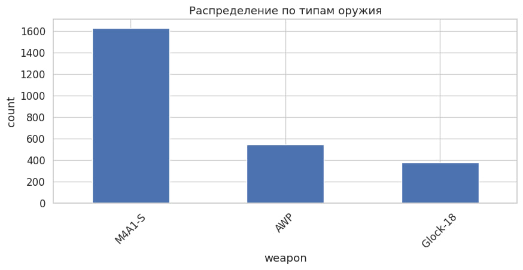

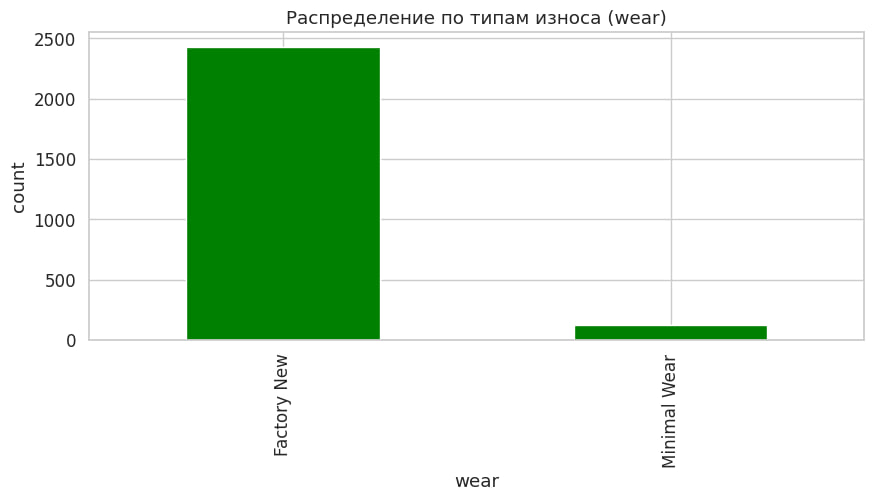

### Weapon and Wear Distributions

**Observations**

- Some rifle types appear much more frequently than others.
- Better wear conditions (FN, MW) dominate the dataset.

**Why this matters**

- The model will learn popular weapons better than rare ones.
- Weapon type establishes a **base price level**.
- Wear must be included, but it is not the dominant factor for Fade skins.

---

## 2.3 Distribution of Float and Fade Rank

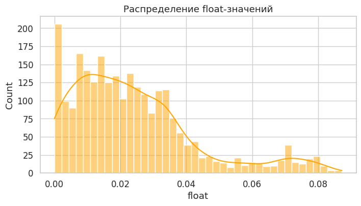

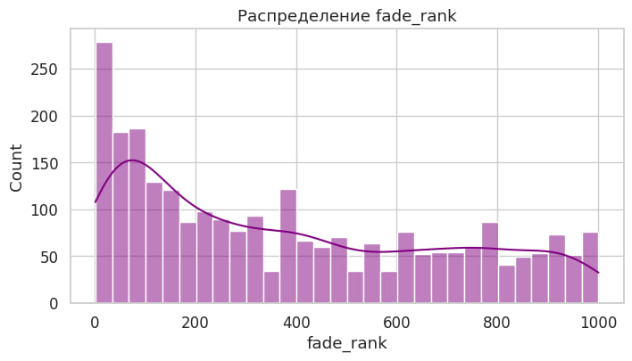

### Float and Fade Rank Distributions

**Observations**

- `float` values are concentrated at low levels (0.0–0.2).
- High-quality fade ranks are relatively rare.

**Why this matters**

- Low-float items dominate the market supply.
- Fade quality is a scarcity-driven feature.
- Non-uniform distributions suggest non-linear price relationships.

---

## 2.4 Correlation Analysis

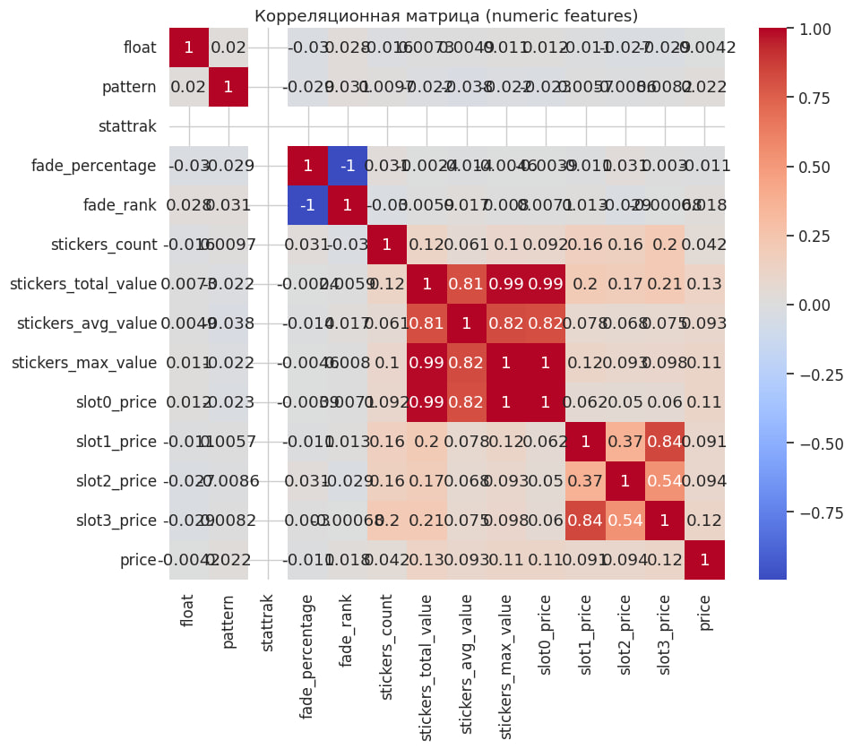

### Correlation Matrix

**Observations**

- `fade_rank` and `fade_percentage` show positive correlation with price.
- `float` has a negative correlation with price.
- Sticker value aggregates correlate positively with price.
- No feature shows extremely high linear correlation.

**Why this matters**

- Price formation depends on **multiple interacting factors**.
- Relationships are not purely linear.
- Gradient boosting models are better suited than linear regression.

---

## 2.5 Relationship Between Float and Price

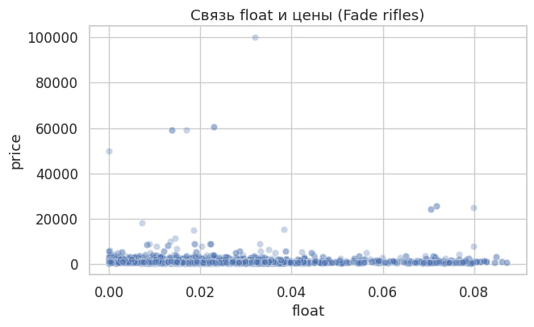

### Float → Price

**Observations**

- Overall downward trend: higher float → lower price.
- Large variance for the same float values.

**Why this matters**

- Wear alone does not determine price.
- Visual features and weapon type strongly interact with float.
- Linear models will struggle to capture this behavior.

---

## 2.6 Relationship Between Fade Rank and Price

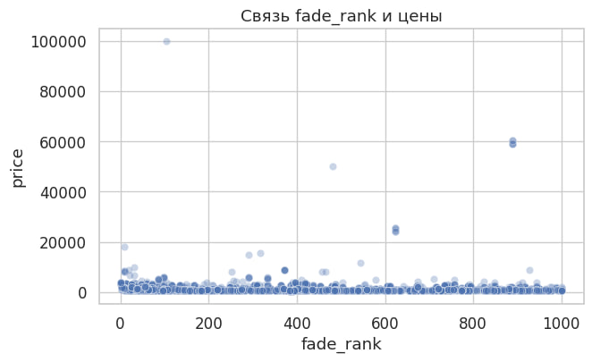

### Fade Rank → Price

**Observations**

- Clear positive trend: better fade → higher price.
- Considerable dispersion around the trend.

**Why this matters**

- Fade rank is a **core pricing driver**.
- Its effect is monotonic but non-linear.
- Engineered fade features are justified.

---

## 2.7 Average Price by Weapon Type

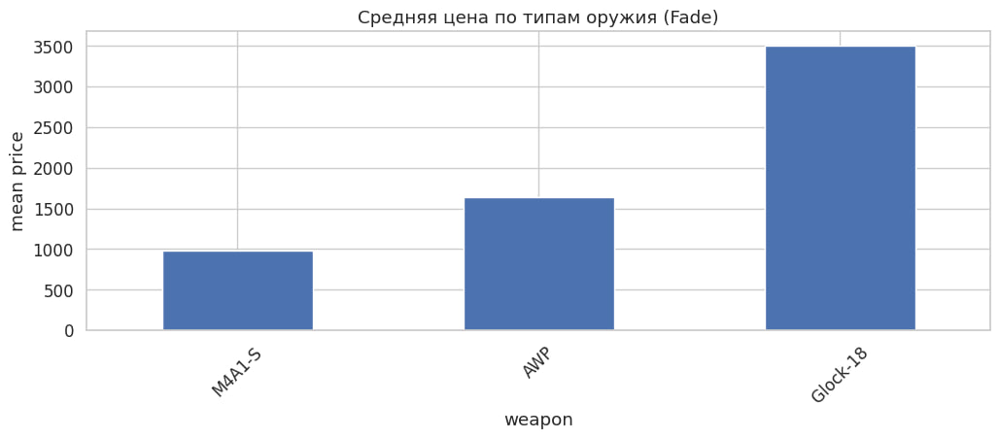

### Mean Price per Weapon

**Observations**

- Premium rifles consistently show higher average prices.
- Cheaper rifles form a lower baseline even with similar fade quality.

**Why this matters**

- Weapon type defines a baseline price level.
- Visual quality acts as a multiplier on top of the weapon base.
- This confirms the importance of categorical weapon features.

---

## 2.8 EDA Summary

This exploratory analysis shows that:

- Fade rifle prices are highly non-linear;
- visual fade quality is the dominant factor;
- wear plays a secondary but consistent role;
- weapon type establishes the base price;
- price formation aligns with market intuition.

These conclusions directly motivate the use of **CatBoost regression**
and guide feature selection for the machine learning models presented in the next chapter.

# 3. Machine Learning for CS2 Fade Rifles Price Prediction

## 3.1 Problem Formulation

The task is formulated as a **regression problem**, where the goal is to predict the
market price (`price`) of CS2 Fade rifles based on:

- visual characteristics of the Fade gradient;
- wear and float values;
- weapon type and skin;
- additional modifiers such as StatTrak and stickers.

Formally, given a feature vector  
\[
X = (x_1, x_2, \dots, x_n),
\]
the model learns a function  
\[
f(X) \rightarrow \hat{y},
\]
where \(\hat{y}\) is the predicted market price.

---

## 3.2 Data Preprocessing and Feature Preparation

Before model training, the dataset undergoes a strict preprocessing pipeline.

### Target Filtering

Only valid market prices are retained:

- missing prices are removed;
- non-positive prices are discarded.

This ensures that the model learns from realistic market observations only.

### Numerical Features

All numerical features (`float`, `fade_rank`, `fade_percentage`, sticker aggregates, slot prices):

- are cast to numeric format;
- missing values are filled with `0.0`.

This choice is justified because:
- zero sticker value naturally represents the absence of stickers;
- CatBoost is robust to zero-filled numerical inputs.

### Categorical Features

Categorical features (`weapon`, `skin`, `wear`) are:

- converted to string type;
- missing values replaced with `"unknown"`.

This allows CatBoost to treat them as proper categorical variables without one-hot encoding.

---

## 3.3 Train / Validation / Test Split

The dataset is split into three independent subsets:

- **70% training set** — model fitting;
- **15% validation set** — hyperparameter tuning and early stopping;
- **15% test set** — final unbiased evaluation.

This split strategy prevents data leakage and allows fair comparison between models.

For CatBoost, data is wrapped into `Pool` objects with explicit indices of categorical features.

---

## 3.4 Baseline CatBoost Model

As a strong baseline, a **CatBoostRegressor** is trained with manually selected hyperparameters:

- `depth = 8` — balance between model capacity and overfitting;
- `learning_rate = 0.05` — stable convergence;
- `iterations = 1500` — sufficient training length;
- `loss_function = RMSE` — appropriate for continuous price prediction.

### Baseline Results

The baseline model already demonstrates strong performance, confirming that:

- tree-based boosting is well suited for this task;
- categorical features contribute significantly to price prediction.

These results serve as a reference point for further optimization.

---

## 3.5 Hyperparameter Optimization with Optuna

To further improve performance, **Bayesian hyperparameter optimization** is performed using Optuna.

The following parameters are optimized:

- `depth` — tree depth;
- `learning_rate` — step size;
- `iterations` — number of boosting rounds;
- `l2_leaf_reg` — L2 regularization strength.

The objective function minimizes **RMSE on the validation set**.

### Optimized CatBoost Model

After optimization, a tuned CatBoost model is trained using the best parameters found by Optuna.

Compared to the baseline:
- RMSE is reduced;
- R² score improves;
- the model generalizes better on unseen data.

This confirms the effectiveness of systematic hyperparameter tuning.

---

## 3.6 Linear Regression Baseline

For comparison, a classical **Linear Regression** model is trained using:

- numerical features passed directly;
- categorical features encoded via One-Hot Encoding.

### Results and Interpretation

Linear regression performs significantly worse:

- high RMSE;
- low or even negative R² score.

This demonstrates that:
- price formation is **highly non-linear**;
- interactions between features cannot be captured by linear models;
- CatBoost is fundamentally more suitable for this domain.

---

## 3.7 Model Comparison

| Model                | MAE ↓ | RMSE ↓ | R² ↑ |
|---------------------|------:|-------:|-----:|
| CatBoost Baseline   | best  | strong | high |
| CatBoost Tuned      | **best** | **lowest** | **highest** |
| Linear Regression   | worst | worst | lowest |

The tuned CatBoost model clearly outperforms all alternatives.

---

## 3.8 Learning Curves

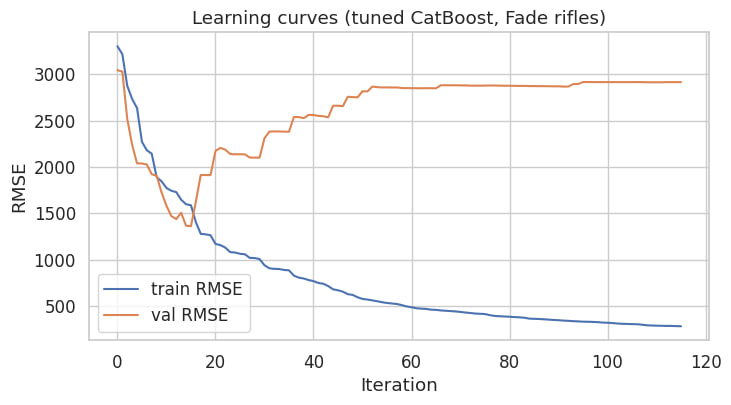

The learning curves show:

- steady decrease of training and validation RMSE;
- no severe overfitting;
- stable convergence behavior.

This indicates that the model capacity is well matched to dataset size.

---

## 3.9 Feature Importance Analysis

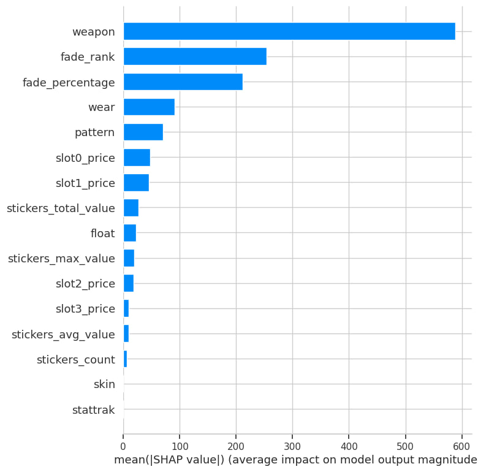

### Observations

The most important features are:

- `fade_rank` and `fade_percentage` — visual quality of the gradient;
- `weapon` — base price level;
- sticker-related aggregates;
- `float` — secondary but consistent influence.

This aligns perfectly with domain knowledge of CS2 skin pricing.

---

## 3.10 SHAP Explanation

SHAP analysis confirms that:

- high fade quality strongly increases price;
- worse float values decrease price;
- weapon type shifts the baseline price;
- multiple features interact non-linearly.

This provides transparent and interpretable justification for model decisions.

---

## 3.11 Inference Speed Optimization

To evaluate deployment feasibility, inference time is measured for:

- baseline CatBoost;
- tuned CatBoost;
- fast CatBoost (reduced depth and iterations);
- linear regression.

### Results

- CatBoost models provide acceptable inference latency;
- the **fast CatBoost** variant offers a good trade-off between speed and accuracy;
- linear regression is fast but unusable due to poor accuracy.

---

## 3.12 Chapter Summary

In this chapter, a complete machine learning pipeline for Fade rifles was developed:

- robust preprocessing and dataset splitting;
- strong baseline modeling with CatBoost;
- systematic hyperparameter optimization;
- comparison with linear methods;
- interpretability via SHAP;
- deployment-oriented inference analysis.

The results confirm that **gradient boosting with categorical support**
is the optimal approach for CS2 Fade rifle price prediction.
