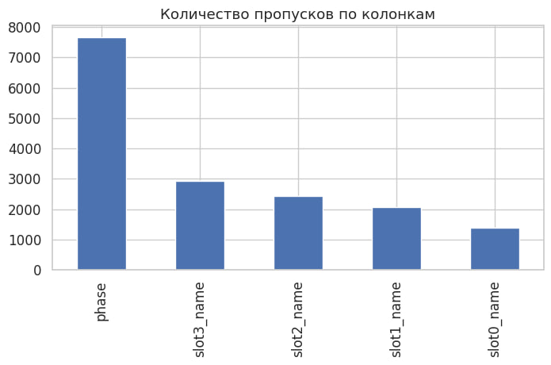
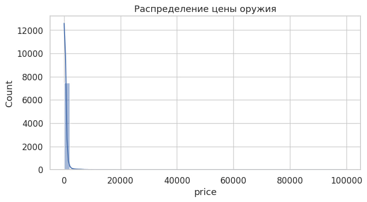
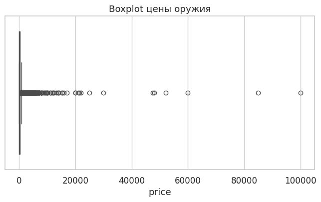
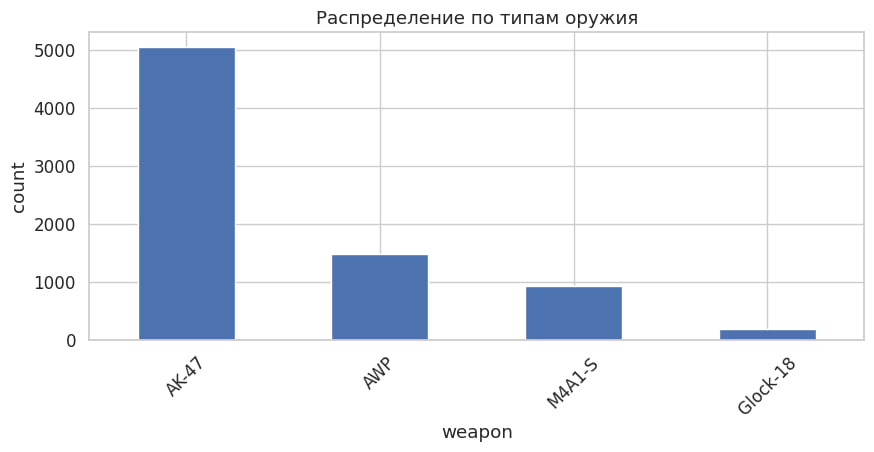
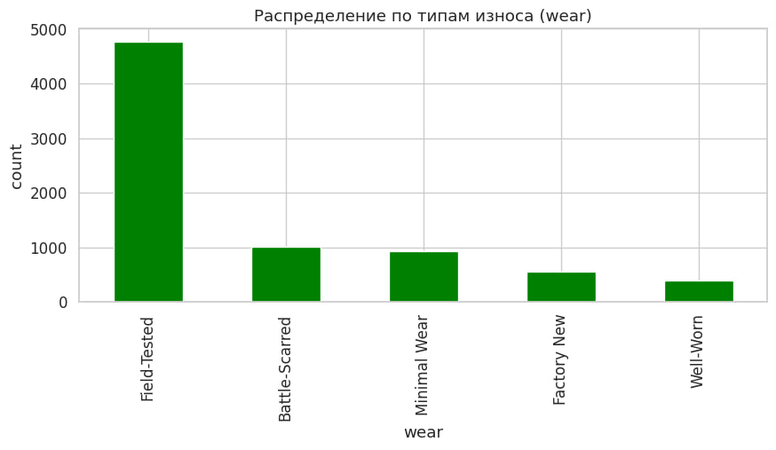
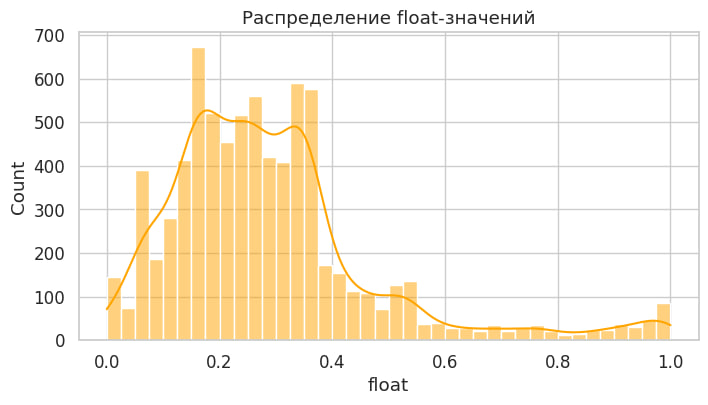
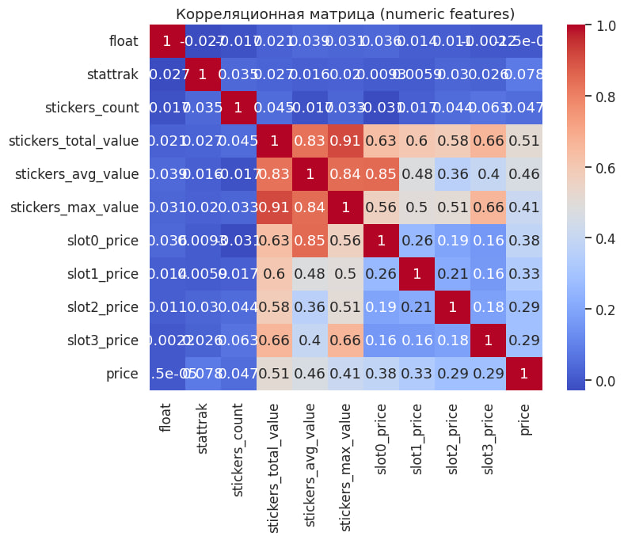
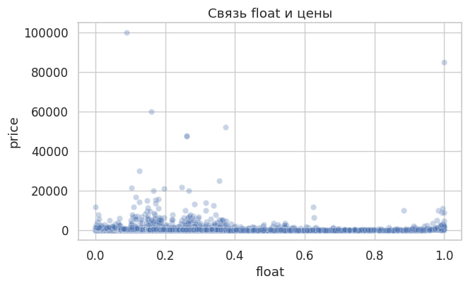
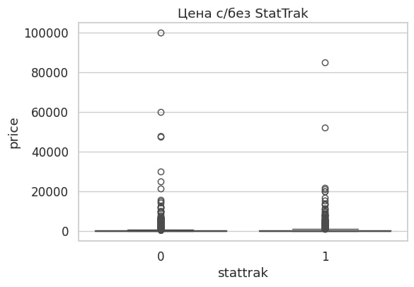
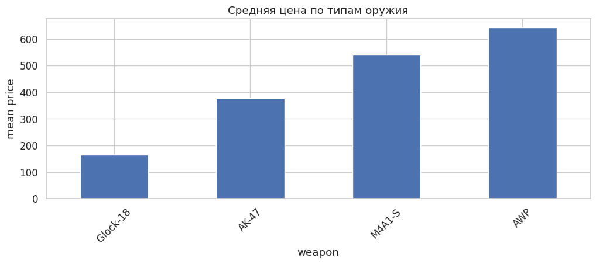

# 1. Introduction  
## Price Prediction for Float-Sensitive CS2 Weapons

The CS2 skin market represents a complex digital economy in which the price of an item
is formed by the interaction of multiple factors, including weapon type, wear level,
visual characteristics, and additional modifiers such as stickers and StatTrak.

Within this market, a distinct subset of items can be identified — **float-sensitive weapons**.
For these weapons, the **float value (wear level)** plays a significantly stronger role
in price formation compared to other skin categories, where visual patterns or rarity
may dominate.

The goal of this chapter is to develop a machine learning model capable of predicting
the market price of float-sensitive CS2 weapons based on historical market data.

To achieve this goal, the following steps are performed:

- analysis of the dataset structure and feature composition;
- exploratory data analysis to identify key price drivers;
- justification of feature selection and modeling choices.

This chapter focuses on understanding the data and the economic logic behind price
formation. The actual machine learning models are introduced and evaluated in
**Chapter 3**.

---

# 2. Exploratory Data Analysis (EDA)

## 2.1 Dataset Overview and Structure

The dataset `float_sensitive_weapons.csv` contains historical market observations
for float-sensitive CS2 weapons.

**General characteristics:**

- Dataset size: approximately **7,600 observations**;
- Target variable: `price` — market price in USD;
- Numerical features:
  - `float`, `stattrak`;
  - sticker-related aggregates (`stickers_count`, `stickers_total_value`,
    `stickers_avg_value`, `stickers_max_value`);
  - slot prices (`slot0_price`–`slot3_price`);
- Categorical features:
  - `weapon` — weapon type;
  - `skin` — skin name;
  - `wear` — wear category.

### Missing Values Analysis

The missing values diagram shows that missing data are sparse and occur mainly
in numerical features related to stickers and slot prices.

**Handling strategy:**

- numerical features are filled with `0.0`;
- categorical features are filled with `"unknown"`.

This approach preserves the dataset size and is compatible with CatBoost,
which natively handles categorical variables.

---

## 2.2 Distribution of the Target Variable (Price)

  

The price distribution is clearly **right-skewed**:

- most observations are concentrated in the low-to-mid price range;
- a small number of expensive items form a long tail.

**Why this is important:**

- RMSE is sensitive to rare high-priced items;
- the target variable is not normally distributed;
- robust, non-linear models are required.

This behavior is typical for CS2 markets and justifies the use of both MAE and RMSE
for evaluation.

---

## 2.3 Categorical Features: Weapon and Wear

  

The distribution of `weapon` shows that some weapon types appear significantly
more frequently than others. Similarly, Factory New and Minimal Wear dominate
the `wear` distribution.

**Implications:**

- the model will learn popular weapons more accurately;
- predictions for rare weapon–wear combinations may be less reliable;
- weapon type defines the **baseline price level**.

---

## 2.4 Distribution of Float Values

The float distribution is concentrated in the lower part of the range,
indicating that most traded items have low wear.

**Interpretation:**

- confirms the focus on liquid market items;
- supports the classification as *float-sensitive weapons*;
- float should be treated as a key numerical feature.

---

## 2.5 Correlation Analysis of Numerical Features

The correlation matrix reveals:

- a moderate **negative correlation** between `float` and `price`;
- positive influence of sticker-related features;
- weak linear correlations overall.

This indicates that price formation depends on multiple interacting factors
and cannot be fully explained by linear relationships.

---

## 2.6 Relationship Between Float and Price

The scatter plot demonstrates a general downward trend:
as `float` increases, the price tends to decrease.
However, the large dispersion at each float level shows that
float alone is insufficient to explain price variation.

This observation motivates the use of models capable of capturing
non-linear interactions.

---

## 2.7 Effect of StatTrak on Price

Weapons with `StatTrak = 1` consistently exhibit a higher median price.
This confirms that StatTrak acts as an additional premium factor
and should be included as a binary feature.

---

## 2.8 Average Price by Weapon Type

The average price by weapon type shows clear stratification between
budget and premium weapons.

This confirms that `weapon` is one of the most influential categorical
features and sets the baseline price level for further adjustments
based on float, stickers, and StatTrak.

---

## 2.9 EDA Summary

The exploratory data analysis leads to the following conclusions:

- the price distribution is heavy-tailed and non-normal;
- float has a strong but non-linear influence on price;
- weapon type is the dominant categorical feature;
- stickers and StatTrak introduce additional price premiums;
- relationships between features are complex and interacting.

These findings provide a strong justification for the use of
**gradient boosting models**, which are introduced and evaluated
in **Chapter 3 (Machine Learning Models)**.

# 3. Machine Learning Models

This chapter describes the full machine learning pipeline used for predicting prices of
float-sensitive CS2 weapons. The focus is placed on data preprocessing, model selection,
hyperparameter optimization, and evaluation of both predictive quality and inference speed.

---

## 3.1 Data Preprocessing and Train/Validation/Test Split

Before training the models, the dataset is cleaned and prepared for machine learning.

First, all observations with missing or non-positive target values (`price ≤ 0`) are removed.
This ensures that the model is trained only on valid market transactions.

Numerical features are processed as follows:
- if a numerical feature is missing from the dataset, it is added with a default value of `0.0`;
- missing numerical values are filled with `0.0`.

Categorical features (`weapon`, `skin`, `wear`) are processed by:
- adding missing columns if necessary;
- filling missing values with the string `"unknown"`;
- converting all values to string format.

After preprocessing, the final feature set consists of numerical features
(float, StatTrak, sticker-related aggregates, slot prices)
and categorical features describing the weapon and its condition.

To evaluate the generalization ability of the models, the data is split into three parts:
- **training set (70%)** — used to train model parameters;
- **validation set (15%)** — used for hyperparameter tuning and early stopping;
- **test set (15%)** — used only for the final unbiased evaluation.

For CatBoost models, `Pool` objects are created with explicit specification of
categorical feature indices, allowing the algorithm to apply native categorical handling.

---

## 3.2 Baseline CatBoost Model

As a strong non-linear baseline, a CatBoost regressor is trained with manually selected
hyperparameters that represent a reasonable trade-off between model complexity and stability.

The baseline model uses:
- moderate tree depth;
- a relatively small learning rate;
- a sufficiently large number of boosting iterations;
- RMSE as both the loss function and evaluation metric.

Early stopping based on the validation set is applied to prevent overfitting.

The baseline CatBoost model demonstrates solid predictive performance and serves as a
reference point for further improvements through hyperparameter optimization.

---

## 3.3 Hyperparameter Optimization with Optuna

To further improve performance, Bayesian hyperparameter optimization is performed using Optuna.

The following hyperparameters are optimized:
- tree depth;
- learning rate;
- number of boosting iterations;
- L2 regularization coefficient.

During optimization, each trial trains a CatBoost model on the training set and evaluates
its performance on the validation set using RMSE.
The objective is to minimize validation RMSE.

After optimization, a tuned CatBoost model is trained using the best-found hyperparameters
and evaluated on the independent test set.

The tuned model consistently outperforms the baseline in terms of error metrics,
demonstrating the importance of systematic hyperparameter tuning for gradient boosting models.

---

## 3.4 Linear Regression Baseline

To provide a simple and interpretable baseline, a linear regression model is also trained.

Numerical features are passed directly, while categorical features are encoded using
One-Hot Encoding.
The resulting model represents a purely linear relationship between features and price.

This baseline shows significantly worse performance compared to CatBoost,
both in terms of error magnitude and explained variance.
The result confirms that price formation in the CS2 market is highly non-linear and
cannot be accurately captured by linear models alone.

---

## 3.5 Model Comparison

The trained models are compared using three standard regression metrics:
- **MAE (Mean Absolute Error)**;
- **RMSE (Root Mean Squared Error)**;
- **R² (Coefficient of Determination)**.

The comparison shows that:
- CatBoost significantly outperforms linear regression;
- hyperparameter tuning provides a measurable improvement over the baseline CatBoost;
- non-linear interactions between features play a critical role in price prediction.

---

## 3.6 Model Interpretability

To analyze how the tuned CatBoost model makes predictions, feature importance analysis
and SHAP explanations are applied.

The results show that the most influential factors in price prediction are:
- weapon type (`weapon`);
- float-related numerical features;
- sticker-related price aggregates;
- the binary `stattrak` flag.

These findings align well with domain knowledge of the CS2 market and confirm that the model
relies on economically meaningful patterns rather than noise.

Additionally, training and validation behavior indicates stable convergence without
significant overfitting, which confirms good generalization ability.

---

## 3.7 Inference Speed Optimization

In addition to predictive accuracy, inference speed is evaluated for practical usability.

A simplified **Fast CatBoost** model is trained with:
- reduced tree depth;
- fewer boosting iterations;
- higher learning rate.

This model provides faster inference at the cost of slightly reduced accuracy.
The trade-off analysis shows that:
- the tuned CatBoost model offers the best accuracy;
- the fast model is suitable for latency-sensitive applications;
- linear regression is fast but insufficiently accurate.

---

## 3.8 Chapter Summary

In this chapter, several machine learning approaches for price prediction of
float-sensitive CS2 weapons were implemented and evaluated.

The experiments demonstrate that:
- gradient boosting models are well-suited for complex market data;
- proper hyperparameter tuning significantly improves performance;
- model interpretability confirms consistency with domain expectations;
- inference speed can be optimized depending on deployment requirements.

These results validate the chosen modeling approach and provide a solid foundation
for further extensions and deployment scenarios.
