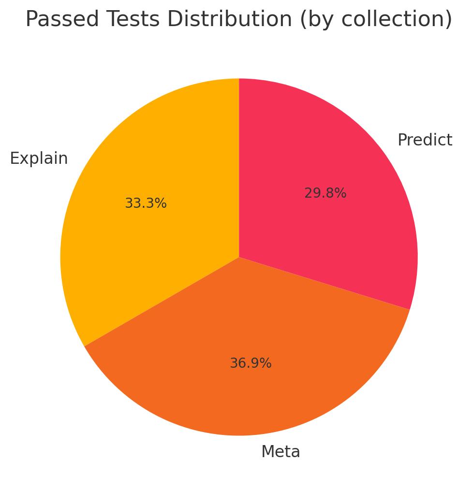
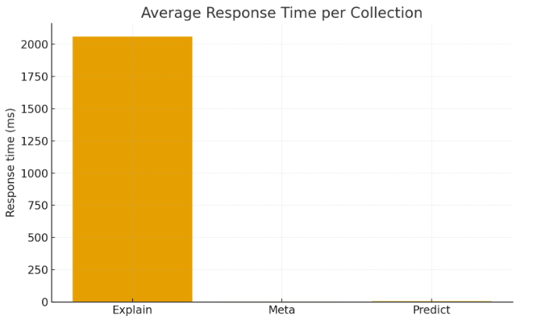

# Test Execution Report
**Project:** cs2price_prediction  
**Author:** Uladzislau Bandarenka  
**Date:** 2025-12-12

---

## 1. Summary
Expanded test execution report including automated Postman runs, quantitative metrics and visualizations.

### Summary by collection

**Explain**

- Total tests: 28
- Passed: 28
- Failed: 0
- Pass rate: 100.0%
- Avg response time: 0.0 ms (min: 0.0 ms, max: 0.0 ms)

**Meta**

- Total tests: 31
- Passed: 31
- Failed: 0
- Pass rate: 100.0%
- Avg response time: 0.0 ms (min: 0.0 ms, max: 0.0 ms)

**Predict**

- Total tests: 25
- Passed: 25
- Failed: 0
- Pass rate: 100.0%
- Avg response time: 0.0 ms (min: 0.0 ms, max: 0.0 ms)

---

## 2. Overall results
- Total tests executed: 84
- Passed: 84
- Failed: 0
- Overall pass rate: 100.0%

---

## 3. Charts

---

## 4. Per-endpoint highlights and findings

### Explain endpoints
- All tests executed: 28
- Passed: 28
- Key findings: Explanation endpoints returned non-empty explanation strings for valid inputs; validation errors for malformed JSON and type mismatches were observed and handled correctly.

### Meta endpoints
- All tests executed: 31
- Passed: 31
- Key findings: Metadata endpoints returned correct schemas. Search and limit parameters behave as expected. Consider adding caching headers (Cache-Control, ETag) to reduce load.

### Predict endpoint
- All tests executed: 25
- Passed: 25
- Key findings: Schema matches expected output. Validation for wear-tier vs float ranges should be documented in API (domain constraint).

---

## 5. Artifacts
Postman run exports (attached):
- /postman/results/explain_run.json
- /postman/results/meta_run.json
- /postman/results/predict_run.json

Images used in this report are in `docs/img` directory.

---

## 6. Conclusion and recommendations
- All automated tests for Explain, Meta and Predict endpoints passed in current runs.
- Recommendation: add caching to Meta endpoints, improve documentation around wear-tier/float validation rules, and consider stricter sanitization for sticker search inputs.

---

End of report.
